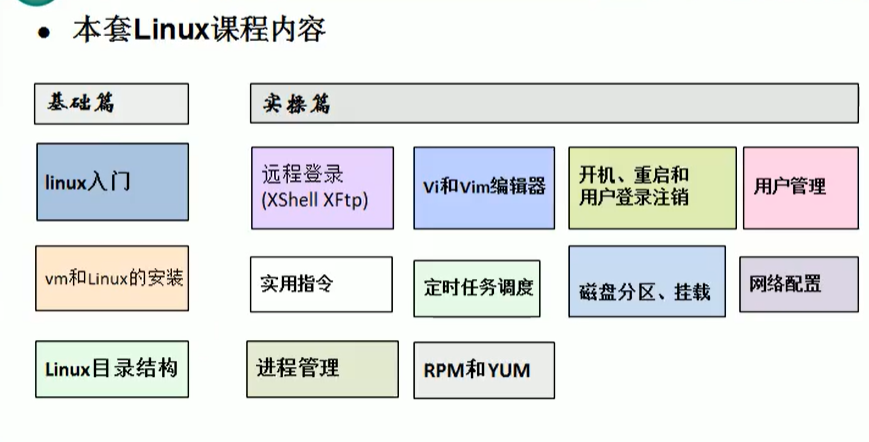
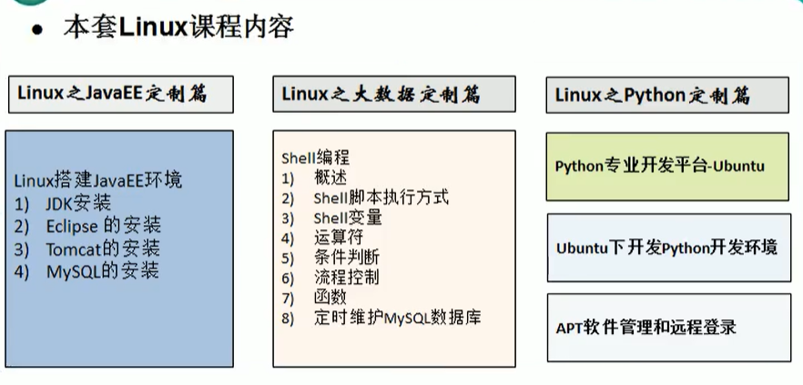
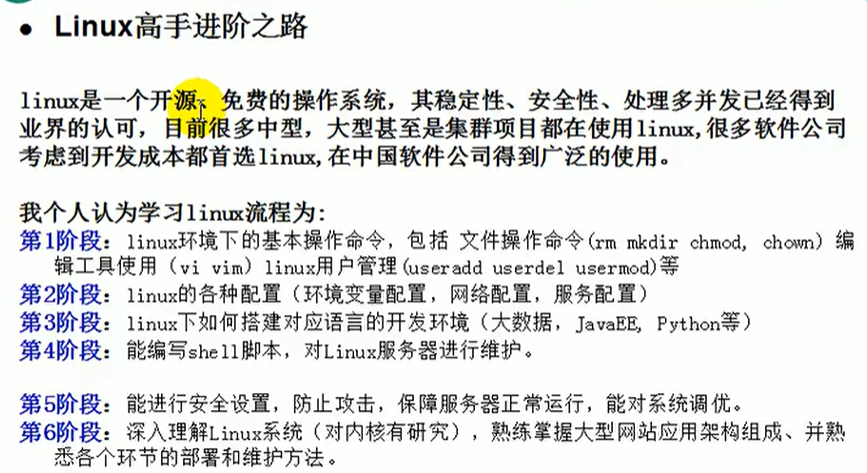
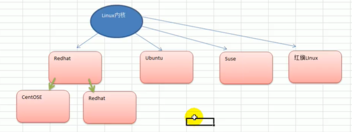
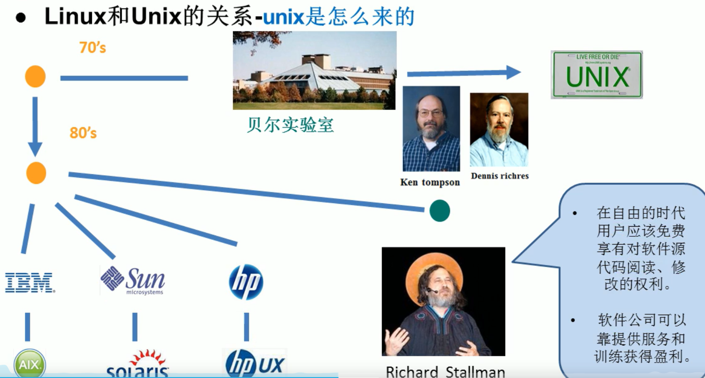
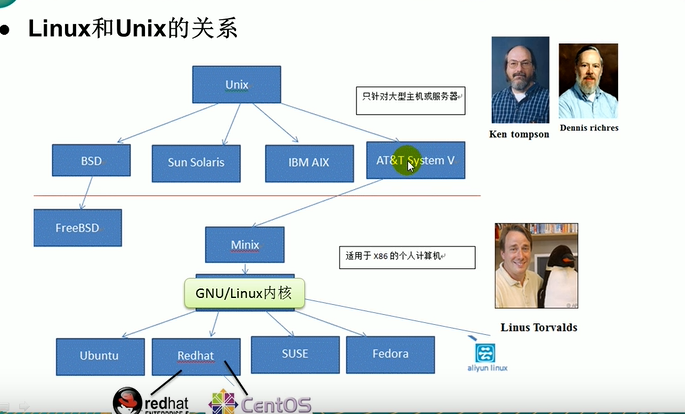
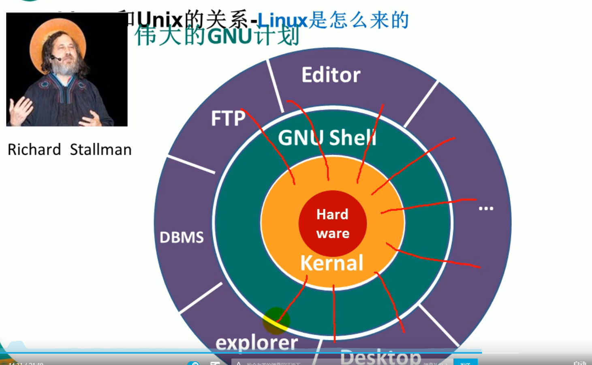
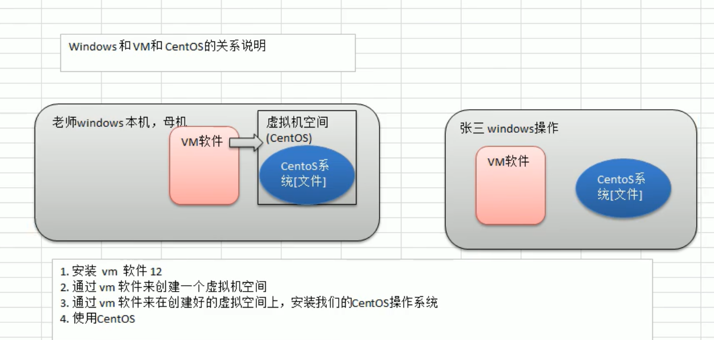

# Linux  入门（基础篇）

## 一 入门

###  入门

###  

### 2. linux学习方向：

## 基础篇

linux 是一款操作系统，免费，开源，安全高效、处理高并发非常强悍。

主要发行版

### VM和Linux的安装

前提：必须先安装VM和centos6.8

### 安装CentOS 

#### 注意事项：

#### 

## linux目录结构

