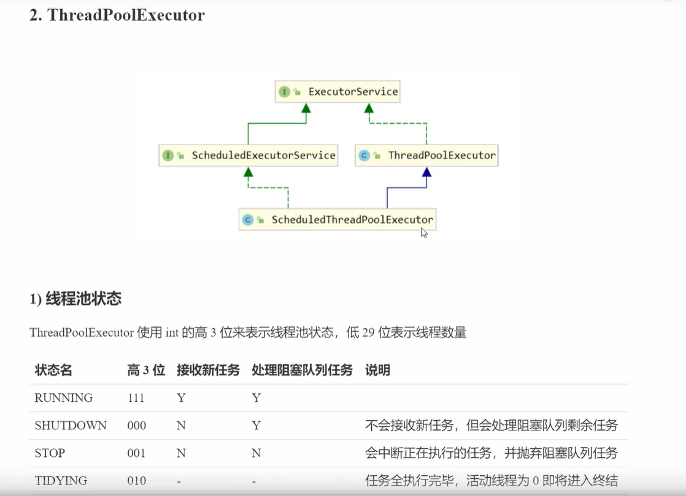
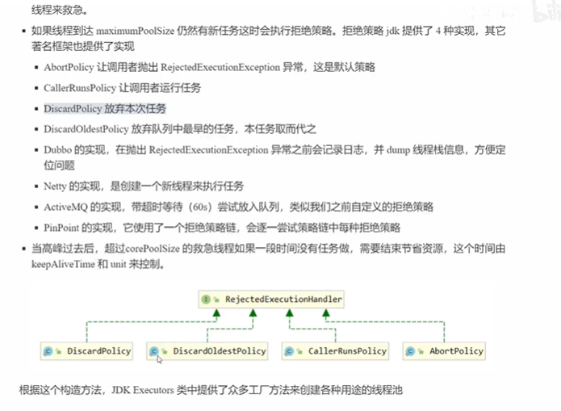
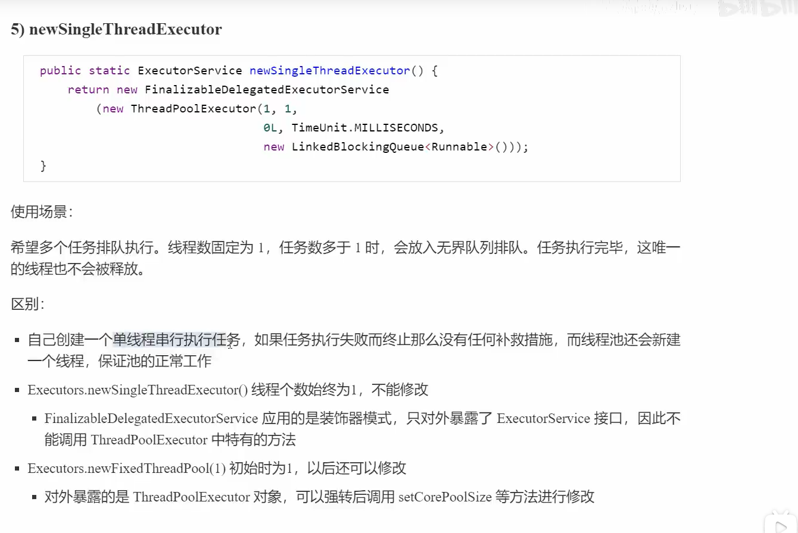
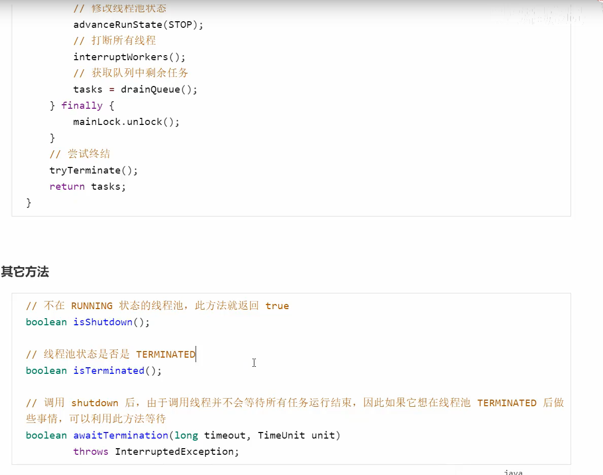
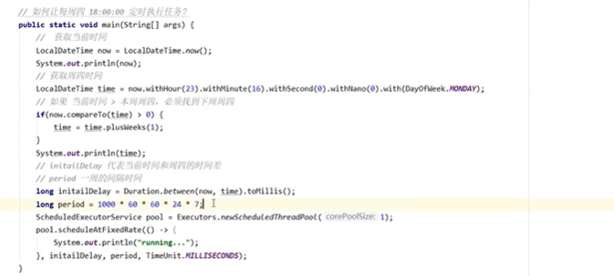
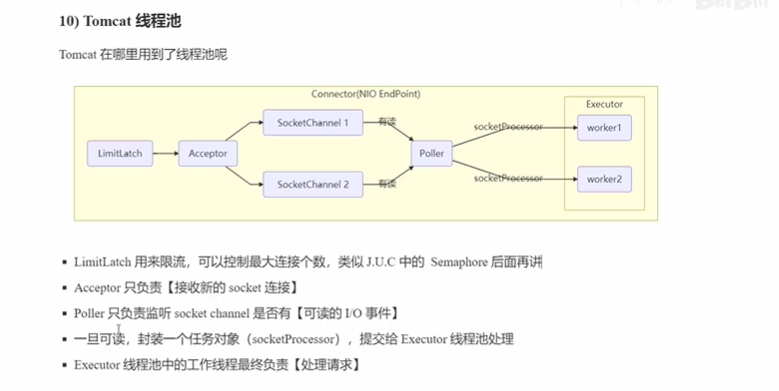
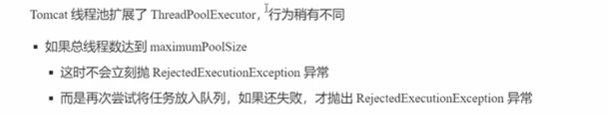
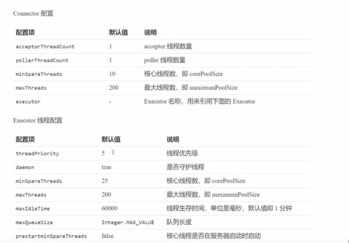

# 并发工具类

## 1. 线程池

### 自定义线程池

```java
package com.itcase;


import java.time.LocalDate;
import java.util.ArrayDeque;
import java.util.Deque;
import java.util.HashSet;
import java.util.concurrent.TimeUnit;
import java.util.concurrent.locks.Condition;
import java.util.concurrent.locks.ReentrantLock;

/**
 * 自定义线程
 * 1. 阻塞队列
 * 2. 线程池
 * 3. 拒绝策略
 * 4.
 */
public class MyThreadPool {
    public static void main(String[] args) {
        ThreadPool threadPool = new ThreadPool(2, 2000L, TimeUnit.MILLISECONDS, 2);
        for (int i = 0; i < 5; i++) {
            threadPool.execute(()->{
                System.out.println("新增线程");
            });
        }
    }
}

// 线程池
class ThreadPool{
//    任务队列
    private BlockQueue<Runnable> taskQueue;
//县城集合
    private HashSet<Worker> workers = new HashSet();
//    核心线程数
    private int coreSize;
//    获取任务的超市时间
    private Long timeout;
//    单位
    private TimeUnit timeUnit;

//    执行任务
    public void execute(Runnable runnable){
       // 当任务数没有超过coresize 时 交给worker执行
       // 如果超过则放入任务队列
        synchronized (workers){
            if(workers.size()<coreSize){
                System.out.println("新增wokers"+runnable);
                Worker worker = new Worker(runnable);
                workers.add(worker);
                worker.start();
            }else {
                System.out.println("加入任务队列"+runnable);
                taskQueue.put(runnable);
            }
        }
    }

    public ThreadPool(int coreSize, Long timeout, TimeUnit timeUnit,int capcity) {
        this.coreSize = coreSize;
        this.timeout = timeout;
        this.timeUnit = timeUnit;
        this.taskQueue = new BlockQueue<>(capcity);
    }

    class Worker extends Thread{

        private Runnable task;

        public Worker(Runnable runnable){
            this.task=runnable;
        }

        @Override
        public void run() {
//            执行任务
//            1. 当task 执行部位空，执行任务
//            2. 当task 执行完毕，在接着看从任务队列获取任务并执行
            while (task!=null || (task=taskQueue.take())!=null){
                try {
                    System.out.println("运行新城方法"+task);
                    task.run();
                }catch (Exception e){
                    e.printStackTrace();
                }finally {
                    task=null;
                }
            }
            synchronized (workers){
                System.out.println("移除"+this);
                workers.remove(this);
            }
        }
    }
}

/**
 * 阻塞队列
 * @param <T>
 */
class BlockQueue<T>{
//    双向lianbiao 任务队列
    private Deque<T> queue = new ArrayDeque<>();

//    2. 锁
    private ReentrantLock lock = new ReentrantLock();

//    3. 生产者的条件变量
    private Condition fullWaitSet = lock.newCondition();

//    4. 消费者的条件变量
    private Condition emptWaitSet = lock.newCondition();

//    5. 容量
    private int capcity;

    public BlockQueue(int capcity) {
        this.capcity = capcity;
    }

    //    等待超时的阻塞获取
    public T poll(Long timeout, TimeUnit unit){
        lock.lock();
        try {
//            将timeout统一转换为纳秒
            long l = unit.toNanos(timeout);
            while (queue.isEmpty()){
                try {
                    if(l<=0){
                        return null;
                    }
                    l = emptWaitSet.awaitNanos(l);
                }catch (InterruptedException  e){
                    e.printStackTrace();
                }
            }
            T t = queue.removeFirst();
            fullWaitSet.signal();
            return t;
        }finally {
            lock.unlock();
        }
    }

//    阻塞获取
    public T take(){
        lock.lock();
        try {
            while (queue.isEmpty()){
                try {
                    emptWaitSet.await();
                }catch (InterruptedException  e){
                    e.printStackTrace();
                }
            }
            T t = queue.removeFirst();
            fullWaitSet.signal();
            return t;
        }finally {
            lock.unlock();
        }
    }
//    阻塞添加
    public void put(T element){
        lock.lock();
        try {
            while (queue.size()==capcity){
                try {
                    fullWaitSet.await();
                }catch (InterruptedException  e){
                    e.printStackTrace();
                }
            }
            queue.addLast(element);
            emptWaitSet.signal();
        }finally {
            lock.unlock();
        }
    }

//    获取大小
    public int size(){
        lock.lock();
        try {
            return queue.size();
        }finally {
            lock.unlock();
        }
    }

}

```


###   ThreadPoolExecutor  



```java

```







### Fork/join

## 2. J.U.C

### 

定时任务线程池

```java
//        System.out.println(addss(new int[]{7, 6, 4, 3, 1}));
        ScheduledExecutorService scheduledExecutorService = Executors.newScheduledThreadPool(1);
        Future<String> submit = scheduledExecutorService.submit(() -> {
            return "";
        });
        submit.get();
        scheduledExecutorService.schedule(()->{
            int i = 1/0;
            System.out.println(11111);
        },1, TimeUnit.SECONDS);
        scheduledExecutorService.schedule(()->{
            System.out.println(22222);
        },2, TimeUnit.SECONDS);

//        定时任务
```




#### Tomcat 线程池





