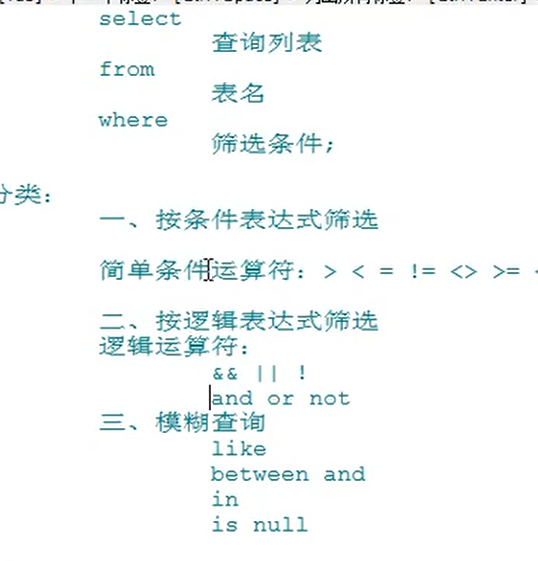
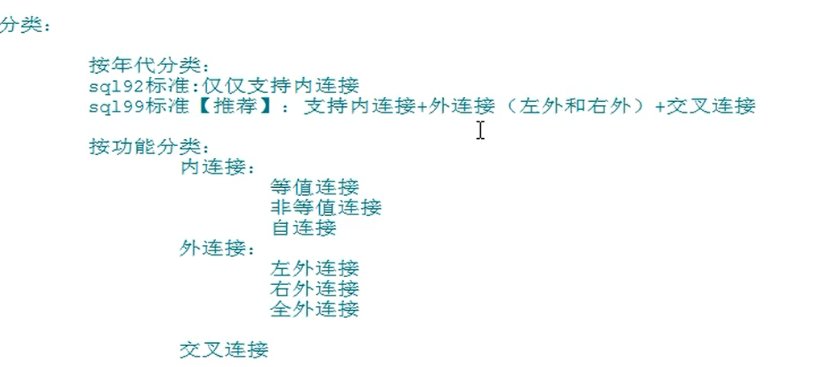
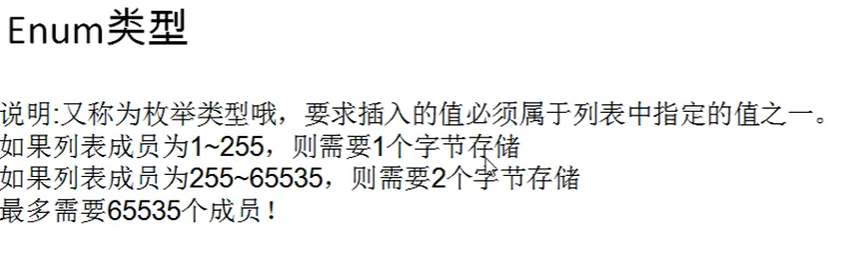
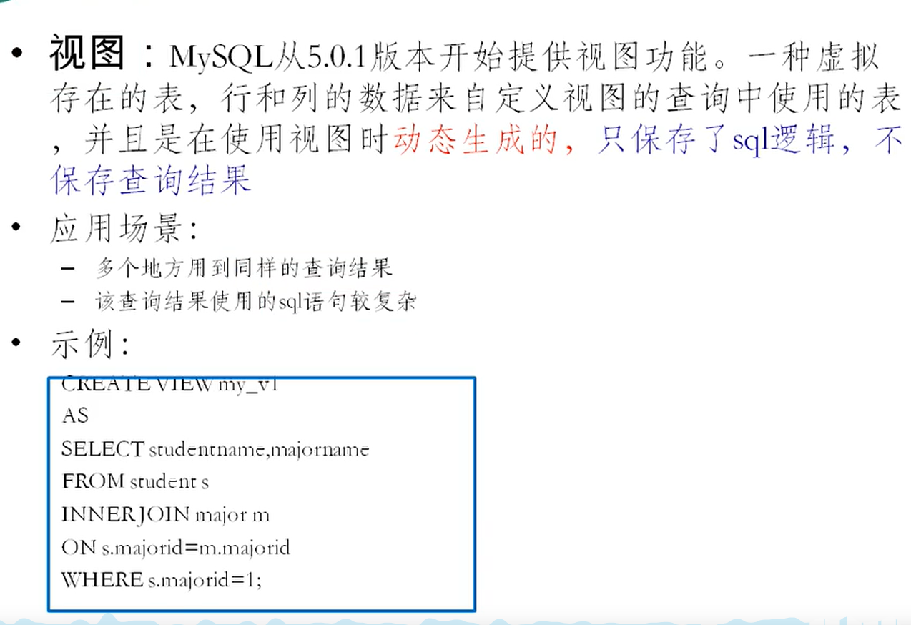
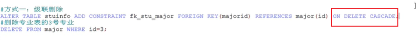

# mysql（关系性数据库）
1. 实现数据持久化
2. 使用完整的管理系统统一管理，易于查询
# 数据库概念：
- DB 数据库（database）: 存储数据的仓库。它保存了一系列有组织的数据。保存一组有组织数据的容器
- DBMS:  数据库管理系统（Database Management System），数据库是通过DBMS创建和操作的容器
- SQL  结构化查询语言  （Structure Query Language）:专门用来与DBMS通信的语言。
1. DBMS 分为两类
   1. 基于文件共享系统的DBMS
   2. 基于客户机-服务器的DBMS(mysql,oracle)
2. mysql 启动停止
   1. net stop mysql(服务名称) 
   2. net start mysql(服务名称) 
   3. mysql -h localhost -P 3306 -u root -p123456 （进入mysql）
3. mysql的常见命令 

4. mysql 的语法规范 
5. DQL 语言  Data Query Language  查询语言
   1. 
   2. 字符串连接CONCAT(str,str)
   3. IFNULL（commission_id,0） 判断是否为空，为空返回0
   4. 
   5. 转义escape 
   6.  
   7.  
   8.  
   9.  
   10.   
   11. 可以根据表达式排序   
   12. 可以根据别名排序   
   13. 可以根据函数排序   
   14. 可以根据多个字段排序   
   15.  
   16.  常见函数   
        1.    
        2.   字符函数：LENGTH获取参数值得字节个数  SELECT LENGTH("JOHN")
        3.   CONCAt 拼接字符串CONCAt（str,str）
        4.   upper,lower   upper（str） 大写  lower(str)小写
        5.   substr、substring sql 语言中索引都是从1开始得 substr("asdasd",6) 
        6.   instr select INSTR("123456张三","张三")；  返回字串在大串里面得索引
        7.   trim 去除字符串前后得空格 trim("  asdas ")   trim('a' from "asdasda")  去除前后得a
        8.   lpad lpad('asda',10,'*')   用指定得字符实现左填充指定长度
        9.   rpad rpad('asda',10,'*')   用指定得字符实现右填充指定长度
        10.  replace 替换  replace('zhasnags','zha','ad')
   17. 数学函数
       1.  round   四舍五入  round(1.25) 四舍五入 round(1.253,2) 小数点后保留几位
       2.  ceil 向上取整，返回大于等于该参数得最小整数
       3.  floor 向下取整，返回《=该参数得最大整数
       4.  truncate 截断  truncate(1.65,1)  小数点后保留几位
       5.  mod 取余 mod(10,3) 
   18. 日期函数
       1.  now() 返回当前系统日期+时间
       2.  curdate（） 返回当权系统日期 ，不办含时间
       3.  curtime() 返回当前的时间
       4.  可以获取指定的部分  
       5.   
       6.  DATEDIFF("2020.1.1","2019.1.6")   求两个日期相差的天数
   19. 其他函数
       1.  select version();
       2.  select DATABASE();
       3.  SELECT USER();
   20. 流程控制函数
       1.   if 函数:if else效果  select if(10《5，'1','2');
       2.   case 函数的使用1  swith case 的效果
            1.     
            2.   类似于多重if 
   21.  分组函数  功能用作统计使用，又称为聚合函数或者统计函数或组函数  sum求和 avg平均值 max最大值 min最小值 count计算个数
        1.   ps:      
   22. 分组查询
       1.       
   23. 连接查询 多表查询
       1.  笛卡尔乘积现象： 表1 有m行 表2 有 n行 结果=m*n行 发生原因：没有有效的连接条件  如何避免： 添加有效的连接条件
       2.  
       3.  sql92标准
           1.  等值连接 select name,boyname from boys,beauty where beauty.boyfriend_id = boys.id 为表起别名，提高语句的简洁度，区分多个重名字段 当起别名后，不能使用原来的表名去限定 
           2.  非等值连接
           3.  自连接 
       4. sql99
          1. 
          2. 内连接 
          3. 
          4. 交叉链接
    24.  子查询     exists(相关子查询)是否存在 返回 1（true） 或者 0(false)  
    25.  分页查询 
    26.  https://www.bilibili.com/video/BV1xW411u7ax?p=96&spm_id_from=pageDriver
6. DML 语言  Data 操作单词 Language 增删改语言 
   1. insert的两种方式   
   2. update 
   3. 删除语句 
   4. https://www.bilibili.com/video/BV1xW411u7ax?p=107&spm_id_from=pageDriver
7. DDL 语言  Data define Language   定义库表语言
   1. 建库语法：create database if not exists(如果没有存在) 库名
   2. 库的修改： 
   3. 更改库的字符集 ALTER DATABASE books character set gdk;
   4. 库的删除 drop database if exists books 
   5.  表的管理
       1.  表的创建 create table 表名(类名 列的类型 【（长度）约束】，【（长度）约束】) 
       2.  表的修改：
           1.  修改列名 ALTER TABLE book CHANGE COLUMN publishdata（旧的列名） pubdate（新的列名） datatime（新的类型）
           2.  修改列的类型或约束  ALTER TABLE book MODIFY pubdate TIMESTEAP
           3.  添加新列 ALTER TABLE book ADD COLUMN adds datatime
           4.  删除列  ALTER TABLE book DROP COLUMN annual
           5.  修改biao名  ALTER TABLE author RENAME TO book_author
           6.  
       3. 表的删除 DROP TABLE book-author
       4. 表的复制  
          1. 复制表的结构 CREATE TABLE copy（新表） LIKE author(复制的表)
          2. 复制表的机构外加数据  CREATE TABLE copy2 select * from author;
          3. 只复制部分数据  CREATE TABLE copy3 select id,au_name from author where nation = '';
          4. 只复制部分表字段结构： CREATE TABLE copy4 select id , au_name from author where 0; (0为false,1为true)
       5. 表的创建
       6. 常见的数据类型
          1. int bigint varchar datatime double  text blob(较长的二进制数据)
          2. 如何设置有符号和无符号  
             1. CREATE TABLE tab_int(t1 INT,t2 INT UNSIGNED)  UNSIGNED 无符号约束
             2. 如果不设置长度，会有默认的长度int(7) ZEROFILL约束会自动将整型转为无符号，并对不够7位的进行长度补齐
             3. https://www.bilibili.com/video/BV1xW411u7ax?p=120&spm_id_from=pageDriver
          3. 
          4. 
          5. 
          6. 字符型 
             1. 简短的文本 char varchar 
             2. 较长的文本 blod text
             3. 枚举类型     
          7. 日期型
             1. date 日期
             2. time 时间
             3. year 年
             4. datetime 
             5. timestamp
             6. 
             7. 
             8. 
          8. 常见约束
             1. 限制，用于限制行或者列的数据，为了保证表中数据的可靠性
             2. 六大约束
                1. NOT NULL ：非空，用于保证该字段不能为空
                2. DEFAULT：默认：用于保证该字段有默认值
                3. PRIMARY KEY：主键 用于保证该字段的值具有唯一性，不能为空
                4. UNIOUE：用于保证该字段的值具有唯一性，但可以为空
                5. CHECK:检查约束【mysql不支持】加条件
                6. FOREIGN KEY： 外键约束 用于限制两个表的关系，用于保证该字段的值必须来源于主表的关联字段，在从表中添加外键约束，用于引用主表中列的值
                7. 
                8. 
                9. 
                10. 
                11. 
                12. 
                13. 
                14. 
                15. 
             3. 修改表时添加约束
                1.  
                2. 
                3. 
                4. https://www.bilibili.com/video/BV1xW411u7ax?p=132&spm_id_from=pageDriver
             4. 标识列
                1. 称为自增长列   可以不用手动的输入值，系统提供给默认的序列值
                2. 创建表时设置标识列
                   1. create table tab_identity( id int primary key auto increment,name varchar(20))
                   2. 查询修改自增的偏移值、及其修改值 
                   3. 
                   4. 
8. DTL 语言  Data transaction Control 事务控制语言
   1. 事务 一个或一组语句组成执行单元，这个执行单元要么全部执行，要么全部不执行
   2. 存储引擎   数据不同的存储技术 
   3. 
   4. 事务的创建 
      1. 隐式的事务：事务没有明显的开启和结束的标志 比如delete insert update
      2. 显式事务：具有明显的开启和结束的标志
         1. 前提： 先设置自动提交功能为禁用
            1. set autocommit = 0; 只针对当前事务有限
         2. 开启事务
   5. 
   6.  设置隔离级别 
   7.   
9. 视图
   1.  虚拟表，和普通表一样使用 ，是通过表动态生成的数据，(mysql5.1中出现的新特性)
   2.  
   3.  创建视图 create view 视图名 as 查询语句
   4.  修改视图 
   5.  删除视图  drop view 视图名，视图名,.....;
   6.  查看视图  show create view 视图名；   desc 视图名；
   7.  
10. 
    1.  级联删除   
    2.  级联置空 
11. 变量
    1.  系统变量 （变量是由系统提供的，不是用户定义，属于服务器层面） 使用语法：
        1.  全局变量
        2.  会话变量
    2.  自定义变量 变量是用户是用户自定义的
        1.  用户变量
            1.  声明 并初始化
                1.  
                2. 查看（查看用户变量的值）
        2.  局部变量 作用域：仅仅在定义它的begin end中有效 应用在begin end 中 的第一句话
            1.  
            2.  使用 
                1.  select 局部变量名；
            3. 
12. 存储过程和函数
    1.  存储过程和函数 ： 类似于java中的方法
        1. 好处 提高代码的重用性
        2. 简化操作
    2.  存储过程：一组预先定义好的sql语句的集合，理解成批处理语句
        1. 好处 提高代码的重用性
           1. 简化操作  
           2. 减少了编译次数并且减少了和数据库服务器的连接次数，提高了效率
        2. 语法
           1. 创建语法
              1. CREATE　PROCEDURE 存储过程名(参数列表)BEGIN 存储过程体（一组合法的SQL语句）  END
              2. 注意 参数列表包含三部分
                 1. 参数模式 参数名 参数类型
                 2. ps：in  stuname VARCHAR(20)
                 3. 参数模式： in该参数可以作为入口（该参数需要调用方传入值）   ou该参数可以作为出口（该参数可以作为返回值）    inout（该参数既需要传入值有需要传出值）
              3. 如果存储过程体仅仅只有一句话，BEGIN END可以省略
              4. 存储过程体的每条SQL语句的结尾要求必须加分号；
              5. 存储过程的结尾可以使用 DELIMITER 重新设置 
              6. 语法： DELIMITER　结束标记 ps:DELIMITER　$
              7. 调用： call 存储过程名(实参列表);
                 1. ps: 
              8. 创建带in模式参数的存储过程
                 1. create procedure map2(in beatutyname varchar(20)) begin end
                 2. 
                 3. 
              9. 带out模式的存储过程
                 1.  
                 2.  
              10. 带inout 模式参数的存储过程
                  1.   
              11. 删除存储过程
                  1.  drop procedure 存储过程名 
              12. 查看存储过程的结构  show create porcedure 存储过程名;
                  1.  存储过程不能修改（navcat好像可以修改）
                  2.  
   3. 函数
      1. 
      2. 创建语法
         1. CREATE FUNCTION 函数名(参数列表)RETURNS 返回类型    BEGIN 函数体  END
            1. 注意：  函数列表包含两部分   参数名   参数类型 
            2. 函数体：肯定会有return语句，如果没有会报错  弱国return 语句没有放在函数体最后也不会报错，但不建议   return 值
            3. 当函数体中只有一句话时可以去省略
            4. 
         2. 调用语法
            1. select 函数名(参数列表);
            2. https://www.bilibili.com/video/BV1xW411u7ax?p=167&spm_id_from=pageDriver
       

