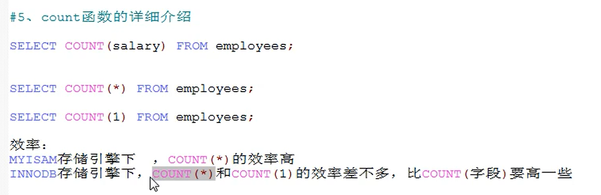
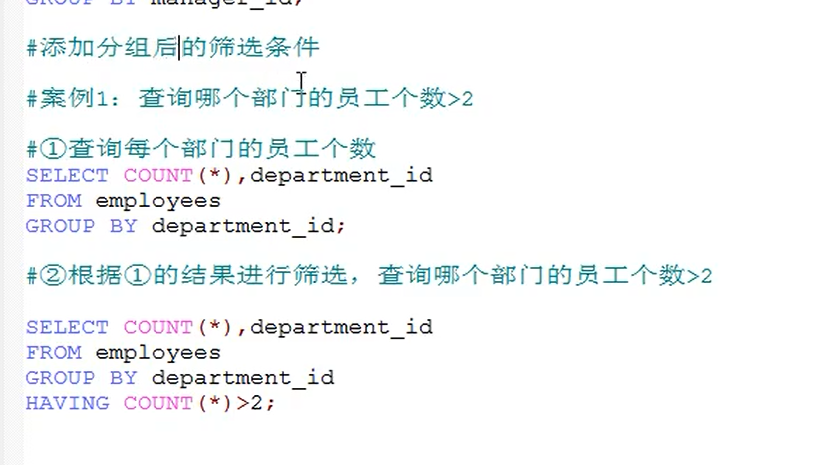

# mysql（关系性数据库）
1. 实现数据持久化
2. 使用完整的管理系统统一管理，易于查询
# 数据库概念：
- DB 数据库（database）: 存储数据的仓库。它保存了一系列有组织的数据。保存一组有组织数据的容器
- DBMS:  数据库管理系统（Database Management System），数据库是通过DBMS创建和操作的容器
- SQL  结构化查询语言  （Structure Query Language）:专门用来与DBMS通信的语言。
1. DBMS 分为两类
   1. 基于文件共享系统的DBMS
   2. 基于客户机-服务器的DBMS(mysql,oracle)
2. mysql 启动停止
   1. net stop mysql(服务名称) 
   2. net start mysql(服务名称) 
   3. mysql -h localhost -P 3306 -u root -p123456 （进入mysql）
3. mysql的常见命令 

4. mysql 的语法规范 
5. DQL 语言  Data Query Language  查询语言
   1. 
   2. 字符串连接CONCAT(str,str)
   3. IFNULL（commission_id,0） 判断是否为空，为空返回0
   4. 
   5. 转义escape 
   6.  
   7.  
   8.  
   9.  
   10.   
   11. 可以根据表达式排序   
   12. 可以根据别名排序   
   13. 可以根据函数排序   
   14. 可以根据多个字段排序   
   15.  
   16.  常见函数   
        1.    
        2.   字符函数：LENGTH获取参数值得字节个数  SELECT LENGTH("JOHN")
        3.   CONCAt 拼接字符串CONCAt（str,str）
        4.   upper,lower   upper（str） 大写  lower(str)小写
        5.   substr、substring sql 语言中索引都是从1开始得 substr("asdasd",6) 
        6.   instr select INSTR("123456张三","张三")；  返回字串在大串里面得索引
        7.   trim 去除字符串前后得空格 trim("  asdas ")   trim('a' from "asdasda")  去除前后得a
        8.   lpad lpad('asda',10,'*')   用指定得字符实现左填充指定长度
        9.   rpad rpad('asda',10,'*')   用指定得字符实现右填充指定长度
        10.  replace 替换  replace('zhasnags','zha','ad')
   17. 数学函数
       1.  round   四舍五入  round(1.25) 四舍五入 round(1.253,2) 小数点后保留几位
       2.  ceil 向上取整，返回大于等于该参数得最小整数
       3.  floor 向下取整，返回《=该参数得最大整数
       4.  truncate 截断  truncate(1.65,1)  小数点后保留几位
       5.  mod 取余 mod(10,3) 
   18. 日期函数
       1.  now() 返回当前系统日期+时间
       2.  curdate（） 返回当权系统日期 ，不办含时间
       3.  curtime() 返回当前的时间
       4.  可以获取指定的部分  
       5.   
       6.  DATEDIFF("2020.1.1","2019.1.6")   求两个日期相差的天数
   19. 其他函数
       1.  select version();
       2.  select DATABASE();
       3.  SELECT USER();
   20. 流程控制函数
       1.   if 函数:if else效果  select if(10《5，'1','2');
       2.   case 函数的使用1  swith case 的效果
            1.     
            2.   类似于多重if 
   21.  分组函数  功能用作统计使用，又称为聚合函数或者统计函数或组函数  sum求和 avg平均值 max最大值 min最小值 count计算个数
        1.   ps:      
   22. 分组查询
       1.       
   23. 连接查询 多表查询
       1.  笛卡尔乘积现象： 表1 有m行 表2 有 n行 结果=m*n行 发生原因：没有有效的连接条件  如何避免： 添加有效的连接条件
       2.  
       3.  sql92标准
           1.  等值连接 select name,boyname from boys,beauty where beauty.boyfriend_id = boys.id 为表起别名，提高语句的简洁度，区分多个重名字段 当起别名后，不能使用原来的表名去限定 
           2.  非等值连接
           3.  自连接 
       4. sql99
          1. 
          2. 内连接 
          3. 
          4. 交叉链接
    24.  子查询     exists(相关子查询)是否存在 返回 1（true） 或者 0(false)  
    25.  分页查询 
    26.  https://www.bilibili.com/video/BV1xW411u7ax?p=96&spm_id_from=pageDriver
6. DML 语言  Data 操作单词 Language 增删改语言 
7. DDL 语言  Data define Language   定义库表语言
8. DTL 语言  Data transaction Control 事务控制语言

