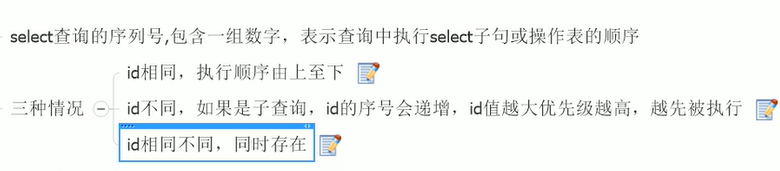
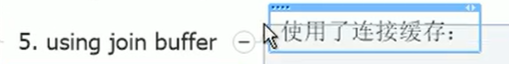

## mysql 高级
### mysql 的架构介绍
#### mysql的简介
https://www.bilibili.com/video/BV1KW411u7vy?spm_id_from=333.788.b_636f6d6d656e74.19

1. 
2. mysql的配置文件
   1. 
   2. 
   3. 
   4. 
   5. 
   6. 
   7. 
   8. 
3. 索引  
   1. 单值索引  只给某一个表的某一个字段去建立索引 create index idx_user_name on user(name);
   2. 复合索引   create index idx_user_name_email on user(name,email);
4. join 查询
   1. 
   2. 
5. 索引
   1. 什么是索引
      1. 索引是帮助Mysql高效获取数据的数据结构，可以得到索引的本质：索引是数据结构。索引是排好序的快速查找数据结构，索引会影响排序和条件查找。
         1. 排好序的快速查找数据结构 
            1. 详解：
            2.  B树索引 
       2.  
       3.  索引的优势 
       4.  索引的lueshi: 
       5.  索引的分类
           1. 单值索引：即一个索引只包含单个列，一个表可以有多个单列索引
           2. 唯一索引：索引的值必须唯一，但允许有空值
           3. 复合索引：即一个索引包含多列
           4. 基本语法：
              1. 
              2. 
       6. mysql索引结构：
          1. BTree索引
             1. 原理  
             2. 那些情况适合创建索引 
             3. 那些情况不需要建立索引  
          2. Hash索引
          3. full-text索引
          4. R-Tree 索引 
   2. 索引的目的
      1. 
6. 性能分析
   1. Mysql Query Optimizer
      1. 
   2. Mysql 的常见瓶颈 
      1. 
   3. Explain
      1. 是什么  
      2. 能干什么 
         1. 
      3. 怎么使用
         1. 
      4. 
      5. 各个字段意义解释：
         1. id:   
         2. select_type  
            1. 有哪些
               1. simple 简单的select 查询，查询中不包含子查询或者union
               2. primary 查询中若包含任何的子部分，最外层查询则被标记为primary
               3. subquery 在select 或者where中包含了子查询的
               4. derived  
               5. union  
               6. union Result  从union表中获取结果的select
         3. table 表名
         4. type 
            1. 所有值 
            2. 从最好的到最差的依次是  system>const>eq_ref>ref>range>index>All
            3. 
               1. 
               2. 
               3. 
               4. 
               5. 
               6. 
               7. 
         5. possible_keys 
         6. key   实际所用到的索引 
            1. 覆盖索引 ： select 后面查询的字段和建索引的个数字段一一一致
         7. key_len 
         8. ref    
         9. rows  
         10. Extra 
             1.  
             2.  
                 1.  
             3. 
                1. 
             4. 
             5. 
             6. 
             7. 
             8. 
      6. ps: 
7. 索引的建立和优化
   1. 索引分析
      1. 单表   
      2. 两表    左连接加右表 右连接加左表索引 
      3. 三表  
   2. 索引失效
      1. 避免索引失效
         1. 
         2. 全值匹配我最爱  复合索引 必须要写出第一个索引字段，否则会失效
            1. 
            2. 中间兄弟不能断
         3. 不在索引列上做任何操作（计算、函数、（自动or手动）类型转换），会导致索引失效而转向全表扫描 
         4. 
         5. 
         6. 
            1. 解决like '%字符串%' 时索引不被使用的方法  使用覆盖索引去查询解决，最好写全
         7. 字符串不加单引号索引会失效   会在底层做隐式的类型转换
         8. 少用 or 连接 ，也会导致索引失效 
         9. 总结 
         10. 对于在条件查询中 索引条件顺序不一致的时候，mysql底层的sql优化器 会对sql进行最优优化，进而达到最好的效果    但最好，怎么写怎么用，节省转换时间
         11. 
         12. https://www.bilibili.com/video/BV1KW411u7vy?p=44&spm_id_from=pageDriver
8. 批量数据插入脚本
   1. 
   2. 
   3. 
9. Show Profile
   1.  
   2.  
   3.  
10. mysql 锁的机制 
    1.  
    2.  