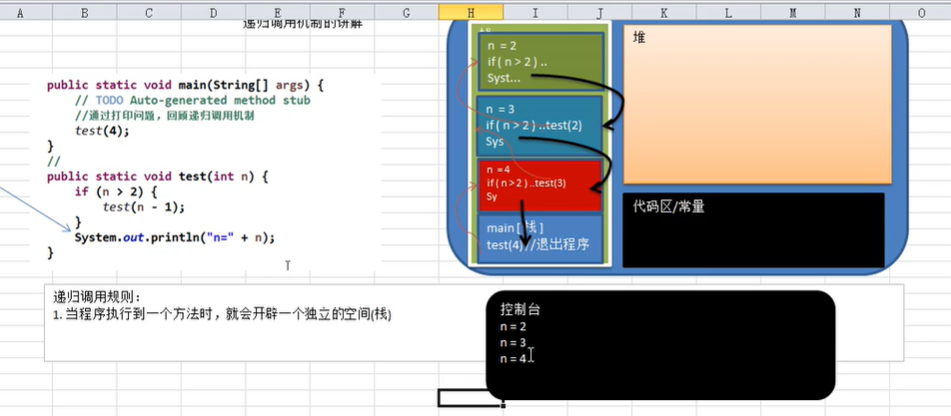

# 稀疏数组 sparsearray数组

只有三列
>第一行记录原始数组,第一行第一列记录有几行，第一行第二列记录有几列，第一行第三列记录有几个值，
>> 从第二行开始第一列代表当前值在那一行，第二列代表当前值在哪一列，第三列代表当前值是什么
- 作用： 压缩数据，进而达到存储少量数据，达到一样的要求,使其简要
# 队列 Queue
先进先出    
- 数组模拟队列思路
    环形数组，
    定义两个指针：
        front: 指向队列的第一个元素，也就是说初始值为0
        rear：最后一个元素的最后一个位置，就是说初始值为0
        maxSize: 数组的总数量
    思路：
        当队列满时，条件是（rear+1）%maxSize=front
        当队列空时，条件是rear=front
        队列中的有效个数据个数为 （rear+maxSize-front）%maxSize
        取数据时指针的位置：rear=(rear+1)%maxSize


# 链表 Linked List
链表时有序的列表，但是他在内存中存储不是有序的，在内存中以链式存储存储数据
- 1、链表是以节点的方式来存储 
- 2、每一个节点包含data域、next域：指向下一个节点
- 3、每一个链表的各个节点不一定是连续存储
- 4、链表分带头节点的  链表和没有代头节点的链表，根据实际需求来确定
## 单向链表的实现:
 思路：
- 1、定义一个有头节点的，变量分别为： 编号 no 参数 name 指向地址 next 
- 2、添加节点，使上一节点next指向该节点，该节点赋值操作
> 不想打字了
https://www.bilibili.com/video/BV1E4411H73v?p=23
## 双向链表
比单项列表多出一个属性，有了前面一个地址的指向
双向链表代码实现思路：
- 1、遍历方法和单链表一样，只是可以向前也可以像后查找
- 2、添加（默认添加到双向列表最后）
>> - 1、先找到双向列表的最后这个节点
>> - 2、temo.next=newHeroNode 
>> - 3、newHeroNode.pre=temp
- 3、修改思路和原理单向链表的一样
- 4、删除
>> - 1、因为是双向链表，因此，我们可以实现自我删除某个节点
>> - 2、找到这个节点 demo ,demo.pre.next=demo.next  ,demo.next.pre=demo.pre
```
package LinkedList;

/**
 * @version 1.0
 * 注意：本内容仅限于西安城市发展资源信息有限公司内部传阅，禁止外泄以及用于其他的商业目
 * @ClassName DoubleLinkedList
 * @Description TODO
 * @Aurhor xu
 * @Ddte 2021/1/2 17:14
 **/
public class DoubleLinkedLists {
    public static void main(String[] args) {
        DoubleLinkedList doubleLinkedList = new DoubleLinkedList();
        HorderNode zhangsan = new HorderNode(1, "zhangsan");
        HorderNode lisi = new HorderNode(4, "李四");
        HorderNode zh =new HorderNode(2,"网五月");
        HorderNode zhangsans = new HorderNode(2, "sss");
        System.out.println(".....................");
        doubleLinkedList.list();
        doubleLinkedList.add(zhangsan);
        doubleLinkedList.add(lisi);
        doubleLinkedList.add(zh);
        System.out.println(".....................");
        doubleLinkedList.list();
        doubleLinkedList.del(1);
        doubleLinkedList.list();
        doubleLinkedList.add(zhangsan);
        doubleLinkedList.list();
        doubleLinkedList.update(zhangsans);
        doubleLinkedList.list();
    }

}

class DoubleLinkedList {
    private HorderNode head = new HorderNode(0, "");

    public HorderNode getHead() {
        return head;
    }

    //遍历链表
    public void list() {
        if (head.next == null) {
            System.out.println("该链表没有数据");
            return;
        }
        HorderNode next = head.next;
        while (true) {
            if (next == null) {
                return;
            }
            System.out.println(next);
            next = next.next;
        }
    }

    //    添加数据
    public void add(HorderNode horderNode) {
        if (head.next == null) {
            horderNode.pre = head;
            head.next = horderNode;
            System.out.println("添加成功11");
            return;
        }
        HorderNode adds = head.next;
        while (true) {
            System.out.println(adds.no);
            if (adds.no > horderNode.no) {
                adds.pre.next=horderNode;
                horderNode.pre=adds.pre;
                horderNode.next=adds;
                System.out.println("添加成功33");
                return;
            }else if(adds.no == horderNode.no){
                System.out.println("已存在此编号，添加失败");
                return;
            }
            HorderNode add=adds;
            adds = adds.next;
            if(adds==null){
                horderNode.pre = add;
                add.next = horderNode;
                System.out.println("添加成功22");
                return;
            }
        }
    }

    //    删除数据
    public void del(int no) {
        if (head.next == null) {
            System.out.println("该链表无数据");
            return;
        }
        HorderNode next = head.next;
        while (true) {
            if (next == null) {
                System.out.println("未找到删除的编号");
                return;
            }
            if (next.no == no) {
                next.pre.next = next.next;
                if (next.next != null) {
                    next.next.pre = next.pre;
                }
                return;
            }
            next=next.next;
        }
    }
//    修改方法
    public void update(HorderNode horderNode){
        if (head.next == null) {
            System.out.println("该链表无数据");
            return;
        }
        HorderNode next = head.next;
        while (true) {
            if (next == null) {
                System.out.println("未找到xiugai的编号");
                return;
            }
            if (next.no == horderNode.no) {
                next.name=horderNode.name;
            }
            next=next.next;
        }
    }
}


class HorderNode {
    //    编号
    public int no;
    //    姓名
    public String name;
    //    指向前面的指针
    public HorderNode pre;
    //    指向后面的指针
    public HorderNode next;

    //构造
    public HorderNode(int no, String name) {
        this.no = no;
        this.name = name;
    }

    @Override
    public String toString() {
        return "HorderNode{" +
                "no=" + no +
                ", name='" + name + '\'' +
                '}';
    }
}
```
## 单向环形链表约瑟夫问题（Josephu问题）
> 构建一个单向的环形链表的思路
1. 先创建第一个节点，让first指向该节点，并形成环形，
2. 后面当我们每创建一个新的节点，就把该节点，加如到已有的环形链表中即可。

> 遍历环形链表
1. 先让一个辅助指针（变量）curbay,指向first节点
2. 然后通过一个while循环遍历该环形链表杰克curBoy.next==first 结束

> 约瑟夫问题思路


# 栈（stack） 线性结构 先进后出

允许插入和删除的一端，为变化的一段，而固定的一段为栈底


应用场景：
- 子程序的调用
- 处理递归的调用
- 表达式的转换[中缀表达式转后缀表达式]与求值
- 二叉树的遍历
- 图形的深度优先（depath-first）搜索法
> java代码实现思路（数组模拟栈的思路）
 1. 使用数组来模拟栈stack[]
 2. 定一个变量top 来表示栈顶，初始值为-1
 3. 入栈的操作，当有数据加入到栈顶，top++;stack[top]=data
 4. 出战的操作，int value= stack[top]; top--, return value

 > 使用栈完成表达式的计算思路
1. 通过一个index值（索引），来遍历我们的表单时
2. 如果我们发现是一个数组，直接入数栈，
3. 如果扫描到是一个符号，就分为以下几种情况
>> 1. 如果发现当前的操作栈为空，就直接入栈
>> 2. 如果操作栈有操作符，就进行比较，如果当前操作符小于等于栈顶的操作符优先级，则需要从数栈中pop出2个数（优先级为后面取得操作前面取得），并从符号栈中pop出一个符号，惊醒运算，并将得到得结果放入数栈，然后将当前得操作符入符号栈，如果当前得操作符优先级大于栈中得操作符，就直接入符号栈
4. 当表达式扫描完毕，就顺序得从数栈和符号栈中pop出相应得书和符号，并运行，
5. 最后在数栈只有一个数字，就是表达式得结果
```
package stack;


import java.util.Scanner;

/**
 * @version 1.0
 * 注意：本内容仅限于西安城市发展资源信息有限公司内部传阅，禁止外泄以及用于其他的商业目
 * @ClassName Clostack
 * @Description TODO
 * @Aurhor xu
 * @Ddte 2021/1/3 10:23
 **/
public class Clostack {
    public static void main(String[] args) {
        StackDemo num = new StackDemo(10);
        StackDemo opers = new StackDemo(10);
        String rec = "90+1*1-10";
        int index = 0;  // rec指针位置
        int num1;  // 数栈取出得第一个数字
        int num2; // 数栈取出得第二个数字
        int sum;   // 两者的乘机
        int oper;  //符号栈取出的符号
        char ch = ' ';  // 扫描出的rec
        String stc="";
        while (true) {
            ch = rec.charAt(index);
// 判度是否为运算符
            if (opers.isoper(ch)) {
//                判度当前符号栈是否为空
                if (opers.isEmpty()) {
                        opers.push(ch);
                } else {
                    //   如果操作栈有操作符，就进行比较，如果当前操作符小于等于栈顶的操作符优先级，则需要从数栈中pop出2个数（优先级为后面取得操作前面取得），
                    //   并从符号栈中pop出一个符号，惊醒运算，并将得到得结果放入数栈，然后将当前得操作符入符号栈，如果当前得操作符优先级大于栈中得操作符，就直接入符号栈
                    int priotery = num.priotery(ch);
                    if (priotery <= num.priotery(opers.stackTop())) {
                        num1 = num.pop();
                        num2 = num.pop();
                        oper = opers.pop();
                        sum = num.cal(num2,num1,oper);
                        num.push(sum);
                        opers.push(ch);
                    }else {
                        opers.push(ch);
                    }
                }

            }else {
                stc +=ch;
//                到了末尾
                if(index>=rec.length()-1){
                    num.push(Integer.parseInt(stc));
                }else{
                    System.out.println(index);
                    int adds=index+1;
                    if(num.isoper(rec.charAt(adds))){
                        num.push(Integer.parseInt(stc));
                        stc="";
                    }
                }
//                num.push(ch-'0');
            }
            index++;
            if(index>=rec.length()){
                break;
            }
        }
        while (true){
//            如果符号栈为空
            if(opers.isEmpty()){
                break;
            }
            num1 = num.pop();
            num2 = num.pop();
            oper = opers.pop();
            sum = num.cal(num2,num1,oper);
            num.push(sum);
        }
        int pop = num.pop();
        System.out.printf("表达式%s=%d",rec,pop);
    }
}

class StackDemo {
    private int maxSize;
    private int top;
    private int[] stack;

    public StackDemo(int maxSize) {
        this.top = -1;
        this.maxSize = maxSize;
        this.stack = new int[maxSize];
    }

    //    判断是否为空
    public Boolean isEmpty() {
        return top == -1;
    }

    //    判度栈是否满
    public Boolean isFull() {
        return top == maxSize - 1;
    }

    //    出栈
    public int pop() {
        if (isEmpty()) {
            throw new RuntimeException("栈为空~~");
        }
        int value = stack[top];
        top--;
        return value;
    }

    //    入栈
    public void push(int value) {
        if (isFull()) {
            System.out.println("栈已满~~");
            return;
        }
        top++;
        stack[top] = value;
    }

    //    遍历数据
    public void list() {
        if (isEmpty()) {
            System.out.println("没有数据~~");
            return;
        }
        for (int i = top; i >= 0; i--) {
            System.out.printf("stack[%d]=%d\n", i, stack[i]);
        }
    }

    //    取出栈顶元素
    public int stackTop() {
        return stack[top];
    }

    //    返回运算符得优先级,根据数字，数字越大优先级越大
    public int priotery(int oper) {
        if (oper == '*' || oper == '/') {
            return 1;
        } else {
            return 0;
        }
    }

    //    判度器是否为运算符
    public Boolean isoper(int oper) {
        return oper == '*' || oper == '-' || oper == '/' || oper == '+';
    }

    //    运算方法
    public int cal(int num1, int num2, int oper) {
        int value = 0;
        switch (oper) {
            case '+':
                value = num1 + num2;
                break;
            case '-':
                value = num1 - num2;
                break;
            case '*':
                value = num1 * num2;
                break;
            case '/':
                value = num1 / num2;
                break;
            default:
                break;
        }
        return value;
    }
}

```
关于栈的三种表达式：
### 前缀（波兰表达式）、中缀、后缀表达式（逆波兰表达式）
<!-- https://www.bilibili.com/video/BV1E4411H73v?p=35 -->
中缀表达式转后缀表达式

代码：
```
package stack;

import java.util.ArrayList;
import java.util.List;
import java.util.Stack;

/**
 * @version 1.0
 * 注意：本内容仅限于西安城市发展资源信息有限公司内部传阅，禁止外泄以及用于其他的商业目
 * @ClassName PolandNotation
 * @Description TODO
 * @Aurhor xu
 * @Ddte 2021/1/4 14:06
 **/
public class PolandNotation {

    public static void main(String[] args) {

        String zzbds = "1+((2+3)* 4  )- 5";
        List<String> arraylists = arraylists(zzbds);
        System.out.println(arraylists);
        List<String> strings = ZzZhZz(arraylists);
        System.out.println(strings);
//        String rec = "1 2 3 + 4 * + 5 -";
//        List<String> strings = arrayList(rec);
        String s = calCulate(strings);
        System.out.println(s);
    }

    //    转后缀表达式的转化方法
    public static List<String> ZzZhZz(List<String> strings) {
        List<String> list = new ArrayList();
//        运算符栈 s1
        Stack<String> s1 = new Stack<>();
//        储存中间结果栈
        Stack<String> s2 = new Stack<>();
//  两个操作数，一个运算符 还有一个结果集，还有一个指针
        int index = 0;
        int num1;
        int num2;
        int oper;
        String sum = "";
        do {
            String s = strings.get(index);
            if (s.matches("\\d+")) {
                s2.push(s);
            }else if ("(".equals(s)){
                s1.push(s);
            }else if(")".equals(s)){
                while (true){
                    String pop = s1.pop();
                    if(!"(".equals(pop)){
                        s2.push(pop);
                    }else{
                        break;
                    }
                }
            }else{
//                if(!s1.empty()) {
//                    if (!s1.peek().equals("(")) {
//                        s2.push(s1.pop());
//                    }
//                }else{
//                    s1.push(s);
//                    return;
//                }
                dgff(s1,s2,s);
            }
            index++;
        } while (index < strings.size());
        if (s1.size() != 0) {
            for (int j=0;j<s1.size();j++){
                s2.push(s1.pop());
            }
        }
        for (String s : s2) {
            sum =sum+s;
        }
        for(int i =0;i<sum.length();i++){
            list.add(sum.substring(i,i+1));
        }
        return list;
    }
//    递归调用的方法
    public static void dgff(Stack<String> s1,Stack<String> s2,String s){
        //                s1栈为空
        if(!s1.empty()){
//                    取出栈顶得元素
            String pop = s1.pop();
            if("(".equals(pop)){
                s1.push(pop);
                s1.push(s);
                return;
            }else{
                if(yxj(s)>yxj(pop)){
                    s1.push(pop);
                    s1.push(s);
                    return;
                }else{
                    s2.push(pop);
                    dgff(s1,s2,s);
                }
            }
        }else{
            s1.push(s);
            return;
        }
    }

    //    中缀表达式转后缀表达式  将字符串转为集合
    public static List<String> arraylists(String zznds) {
        List<String> list = new ArrayList<>();
        String stc = "";
//        记此器
        int j = 0;
        while (true) {
            String substring = zznds.charAt(j)+"";
//            判度不为空
            while (true) {
                if (!" ".equals(substring) && !"".equals(substring)) {
//                    是一个数字
                    if (substring.matches("\\d+")) {
                        stc = stc+substring + "";

                    } else {
                        if ("".equals(stc)) {
                            list.add(substring);
                            break;
                        } else {
                            list.add(stc);
                            list.add(substring);
                            stc = "";
                            break;
                        }
                    }
                }
                j++;
                if(j==zznds.length()){
                    if(!stc.isEmpty()){
                        list.add(stc);
                        stc="";
                    }
                    break;
                }
                substring = zznds.charAt(j)+"";
                System.out.println(j+"d");


            }

            System.out.println(zznds.length());
            if (j >= zznds.length()-1) {
                break;
            }
            j++;
        }
        return list;
    }


    public static int yxj(String opers){
        int value=0;
        switch (opers){
            case "-":
            case "+":
                value= 1;
                break;
            case "/":
            case "*":
                value= 2;
                break;
        }
        return value;
    }

    //   将字符串转为list集合
    public static List<String> arrayList(String rec) {
        if (rec.isEmpty()) {
            System.out.println("字符串为空");
            return null;
        }
        String[] s = rec.split(" ");
        List arrayList = new ArrayList();
        for (String s1 : s) {
            arrayList.add(s1);
        }
        return arrayList;
    }

    //    计算方法
    public static String calCulate(List<String> strings) {
//        创建栈区
        Stack<Integer> stack = new Stack();
        int num1;
        int num2;
        int sum;
        for (String string : strings) {
//            如果位数字
            System.out.println(stack);
            if (string.matches("\\d+")) {
                stack.push(Integer.parseInt(string));
            } else {
                num1 = stack.pop();
                num2 = stack.pop();
                switch (string) {
                    case "+":
                        sum = num1 + num2;
                        stack.push(sum);
                        break;
                    case "-":
                        sum = num2 - num1;
                        stack.push(sum);
                        break;
                    case "*":
                        sum = num1 * num2;
                        stack.push(sum);
                        break;
                    case "/":
                        sum = num1 / num2;
                        stack.push(sum);
                        break;
                    default:
                        break;
                }
            }
        }
        return stack.pop() + "";
    }
}
```
# 递归 Recursion
递归就是调用自己

递归时需要遵循得重要规则：
1. 执行一个方法时，就创建一个新的受保护得独立空间（栈空间）,
2. 如果方法中使用的是引用类型变量，就会共享该引用类型得数据
3. 方法中的局部变量是独立得，不会相互影响，比如n变量
4. 递归必须向退出递归得方法毕竟，否则就是无限递归
5. 当一个方法执行完毕，或者遇到return，就会返回，遵守谁调用，九江结果返回给谁，同事当方法执行完毕或者返回时，盖房阿飞也就执行完毕。
