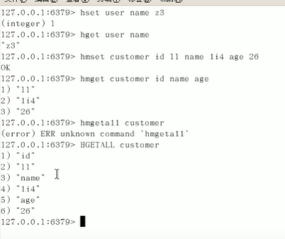

# nosql 数据库
1. 是什么 
2. 与传统数据库的区别 
3. nosql数据模型  
4. nosql数据四大分类  
5. 分布式数据库中CAP原理CAP+BASE 
   1. 
   2. 
   3. 
   4. 
## redis REmote DIctionary Server(远程字典服务器)
1. redis 
   1. 切换库 select 5 一共16个库
   2. 查看所有的键在某个库 keys *,查看前面有k的键 keys k?
   3. 查看当前库的大小 dbsize 
   4. 清除当前库 Flushdb 
   5. 通杀所有库： Flushall
   6. redis的索引从0开始
2. redis 的数据类型
   1. 
3. redis 常见数据类型操作命令 http://redisdoc.com
4. key
   1. set k1 v1 存值
   2. get k1 根据键取值
   3. exits k1 判断是否存在
   4. move k3 2 将某个键移到那个库
   5. 
5. string   
   1. 
6. list
   1. 
   2. 
   3. 
7. set 
   1. 
8. hash
   1. 
   2. 
9. Zset
   1.  
   2.  
10. redis配置文件
    1.  redis.conf 
    2.  
    3.  
    4.  
    5.  
    6.  
    7.  
11. redis 的持久化
    1.  rdb (redis database)
        1.  
        2.  
        3.  
        4.    save命令可以直接保存
        5.  
        6.  
        7.  
        8.  
        9.  
        10. 
    2.  aof (append only file)
        1.  
        2.  aof文件出错后 
        3.  
        4.  rewrite 
        5.  
        6.  
        7.  
        8.  
        9.  
    3.  两者区别
        1.  
        2.  
        3.  
    4.  https://www.bilibili.com/video/BV1oW411u75R?p=18&spm_id_from=pageDriver
12. redis 事务
    1.  
    2.  
    3.  
    4.  编译时报错 全体连坐 运行时报错 冤头寨主 对事务支持为部分支持
    5.  
        1.  悲观锁 整张表全锁
        2.  乐观锁 不会上锁，行内容加入version 
    6. 特性：
13. redis的发布订阅机制
    1.  
    2.  命令：
14. redis 的复制机制
    1.  主从复制，读写分离 
    2.  读写分离，容灾恢复
    3.  配从不配主 
    4.  命令：info replicayion 查看redis信息
        1.  一株2从
            1.  SLAVEOF 地址 端口  从机备份数据
            2.  把主机的数据从头录到尾
            3.  只有主机才能写，从机负责读
            4.  当主机挂掉之后，从机原地待命，主机恢复之后，恢复正常
            5.  当从机挂掉之后，重启后需要重新连接（除非写进配置文件redis.conf）
        2. 薪火相传
           1. 
        3. 反客为主
           1. 当从机挂掉之后，从机slaveof no one 让从机成为新的领导
           2. 以前的主机回来后也不会成位新的主机
           3. 别的从机需要重新设置主机
           4. 
    5. 复制原理
       1. 
    6. 哨兵模式（） 反客为主的自动版
       1. 