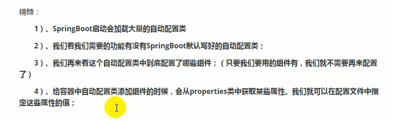
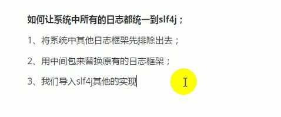

# springboot 优点
## 1.spring Boot 简介
> 简化spring应用开发的一个框架
> 整个Spring技术栈的一个大集合
> J2EE开发的一站式解决方案
- 优点


## 微服务 
2014 Martin fowler 
微服务 ： 架构风格
一个应用应该是一组小型服务;可以通过HTtp的方式通过应用

## springboot 探究

@AutoConfigurationPackage: 自动配置包

   @Import(AutoConfigurationPackages.Registrar.class)
   spring底层注解@import,给容器中导入一个组件，导入的组件由AutoConfigurationPackages.Registrar.class
   将主要配置类@SpringBootApplication 表注的类的所有包及下面的子报里面的所有组件扫描到Spring容器中


   @Import(EnableAutoConfigurationImportSelector.class)
 给容器导入组件
 EnableAutoConfigurationImportSelector  开启自动配置类导包的选择器    将所有需要导入的组件以全类名的方式返回；这些组件就会被添加到容器中；会给容器中导入这个场景需要的所有组件，并配置好这些组件
 

 SpringFactoriesLoader.loadFactoryNames(EnableAutoConfiguration.class,ClassLoader);
 作用
 springboot在启动的时候，会从类路径下的META-INF/spring.factories中获取EnableAutoConfiguration 指定的值，将这些的值作为自动配置类导入到容器中，自动配置类就会生效，帮我们进行自动配置工作；
 J2EE 的整体整合解决方案和自动配置都在spring-boot-autoconfigure-1.5.9下

 ## 配置文件

  springboot 使用一个全局的配置文件
  - application.properties
  - application.yml
  - 配置文件的作用：修改SpringBoot的默认配置；SpringBoot在底层都给我们配置好了

> YAML (YAML Ain't Markup Language)  
> 标记语言
>   以前的配置文件；大多是asdas.xml
>   YAML:以数据为中心，比Json,xml更适合坐配置文件

基本语法
- k:(空格) v: 表示一对键值对（空格必须有）
- 以空格的缩进来控制层级关系；只要是左对齐的就等与在同一级


@ConfigurationProperties 只有这个组件是容器中的组件，才能使用容器提供的功能


配置文件注入值，数据校验


加载指定的配置文件


@importResource
：导入Spring的配置文件，让配置文件里面的内容生效
Spring boot 里面没有Spring的配置文件，我们自己编写的配置文件，也不能自动识别；
想让Spring的配置文件生效，加载进来，@importResource标注在一个配置类上


配置文件占位符


### profile


### 配置文件加载位置


### 外部文件加载配置


java -jar asjdjahsdjha.jar --server.port=8085

### 自动配置园丽


1. springboot启动的时候加载主配置类，开启自动配置的功能@EnableAutoConfiguration
2. @EnableAutoConfiguration 作用：
     利用AutoConfigurationImportSelector 给容器中导入一些组件
     查看selectImports(AnnotationMetadata annotationMetadata)便知道导入哪些内容，
     	List<String> configurations = getCandidateConfigurations(annotationMetadata, attributes); 获取候选的配置
       

```
          SpringFactoriesLoader.loadFactoryNames(getSpringFactoriesLoaderFactoryClass(),
				getBeanClassLoader());
                从properties中获取到 EnableAutoConfiguration.class类的值

                	Enumeration<URL> urls = classLoader.getResources(FACTORIES_RESOURCE_LOCATION);
                  获取类路径（META-INF/spring.factories）下的所有资源
```

 
 
 
 
 
### @Conditional  待研究

自动配置类在一定条件下才能生效


## 日志


### SLF4J使用


- 每一个日志的实现框架都有自己的配置文件。使用slf4j以后，配置文件还是写成日志实现框架的配置文件




https://www.bilibili.com/video/BV1gW411W76m?p=24&spm_id_from=pageDriver