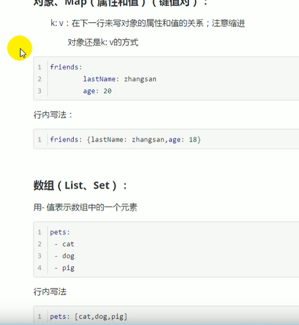

# springboot 优点
## 1.spring Boot 简介
> 简化spring应用开发的一个框架
> 整个Spring技术栈的一个大集合
> J2EE开发的一站式解决方案
- 优点

## 微服务 
2014 Martin fowler 
微服务 ： 架构风格
一个应用应该是一组小型服务;可以通过HTtp的方式通过应用

## springboot 探究

@AutoConfigurationPackage: 自动配置包

   @Import(AutoConfigurationPackages.Registrar.class)
   spring底层注解@import,给容器中导入一个组件，导入的组件由AutoConfigurationPackages.Registrar.class
   将主要配置类@SpringBootApplication 表注的类的所有包及下面的子报里面的所有组件扫描到Spring容器中

   @Import(EnableAutoConfigurationImportSelector.class)
 给容器导入组件
 EnableAutoConfigurationImportSelector  开启自动配置类导包的选择器    将所有需要导入的组件以全类名的方式返回；这些组件就会被添加到容器中；会给容器中导入这个场景需要的所有组件，并配置好这些组件
 

 SpringFactoriesLoader.loadFactoryNames(EnableAutoConfiguration.class,ClassLoader);
 作用
 springboot在启动的时候，会从类路径下的META-INF/spring.factories中获取EnableAutoConfiguration 指定的值，将这些的值作为自动配置类导入到容器中，自动配置类就会生效，帮我们进行自动配置工作；
 J2EE 的整体整合解决方案和自动配置都在spring-boot-autoconfigure-1.5.9下

 ## 配置文件

  springboot 使用一个全局的配置文件
  - application.properties
  - application.yml
  - 配置文件的作用：修改SpringBoot的默认配置；SpringBoot在底层都给我们配置好了

> YAML (YAML Ain't Markup Language)  
> 标记语言
>   以前的配置文件；大多是asdas.xml
>   YAML:以数据为中心，比Json,xml更适合坐配置文件

基本语法
- k:(空格) v: 表示一对键值对（空格必须有）
- 以空格的缩进来控制层级关系；只要是左对齐的就等与在同一级

@ConfigurationProperties 只有这个组件是容器中的组件，才能使用容器提供的功能

https://www.bilibili.com/video/BV1gW411W76m?p=11&spm_id_from=pageDriver
