# jdbcTemplate(概念和准备)
1. 什么是jdbcTemplate 
   1. spring框架对jdbc进行封装，使用jdbcTemplate 方便实现对数据库操作
2. 准备工作
   1. 引入相关的jdbcTemplate jar包 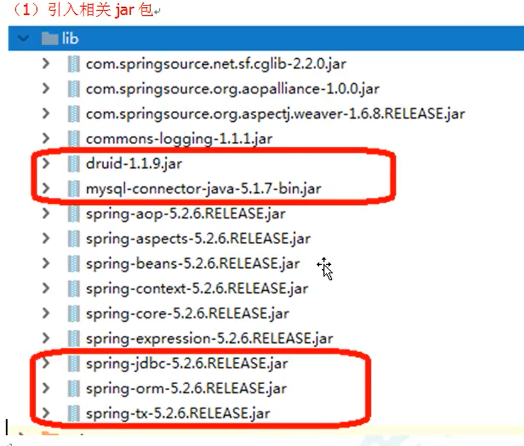
   2. 在spring配置文件中配置德鲁伊连接池的配置
```xml
<?xml version="1.0" encoding="UTF-8"?>
<beans xmlns="http://www.springframework.org/schema/beans"
       xmlns:xsi="http://www.w3.org/2001/XMLSchema-instance"
       xsi:schemaLocation="http://www.springframework.org/schema/beans http://www.springframework.org/schema/beans/spring-beans.xsd">
        <bean id="dataSource" class="com.alibaba.druid.pool.DruidDataSource"
              destroy-method="close">
            <property name="url" value="jdbc:mysql://127.0.0.1:3306/jpa"></property>
            <property name="username" value="root"></property>
            <property name="password" value="123456"></property>
            <property name="driverClassName" value="com.mysql.jdbc.Driver"></property>
        </bean>
</beans>
```
3. 配置jdbcTemplate 对象 并注入DataSource
```xml 
<!--    创建jdbcTemplate 的对象-->
    <bean id="jdbcTemplate" class="org.springframework.jdbc.core.JdbcTemplate">
        <property name="dataSource" ref="dataSource"></property>
     </bean>
```
4. 创建service dao类，在dao 注入JdbcTemplate对象
- 开启组件扫描
```xml
  <context:component-scan base-package="com.atguigu"></context:component-scan>
```
- service
```java
@Service
public class UserService {
    @Autowired
    private UserDao userDao;
}
```
- dao
```java
@Repository
public class UserDao {
    @Autowired
    private JdbcTemplate jdbcTemplate;
}
```


```java

    public void adds(User user){
        Object[] args = {user.getName()};
        int update = jdbcTemplate.update("insert into user(names) values(?)", args);
        System.out.println(update);
    }
```
返回一个数据
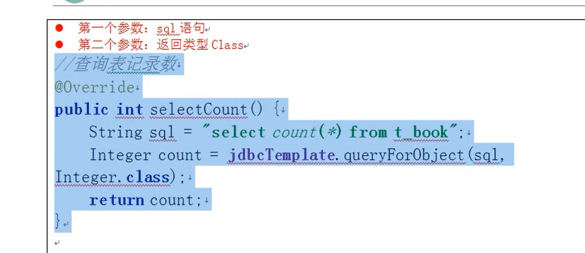
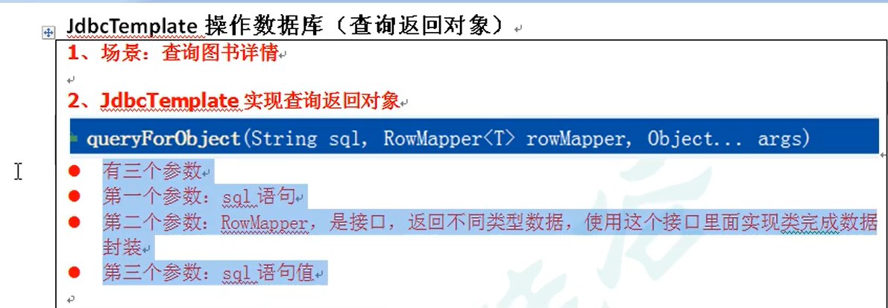
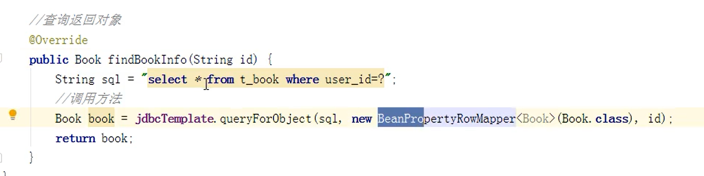
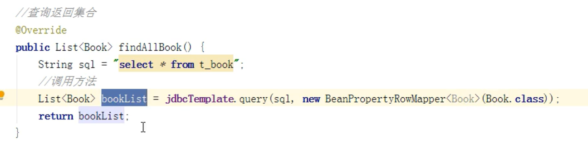
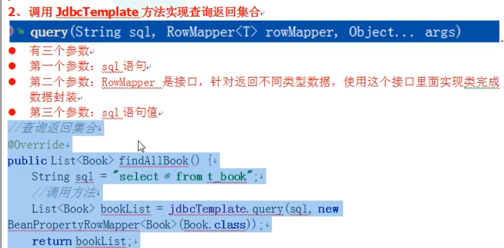
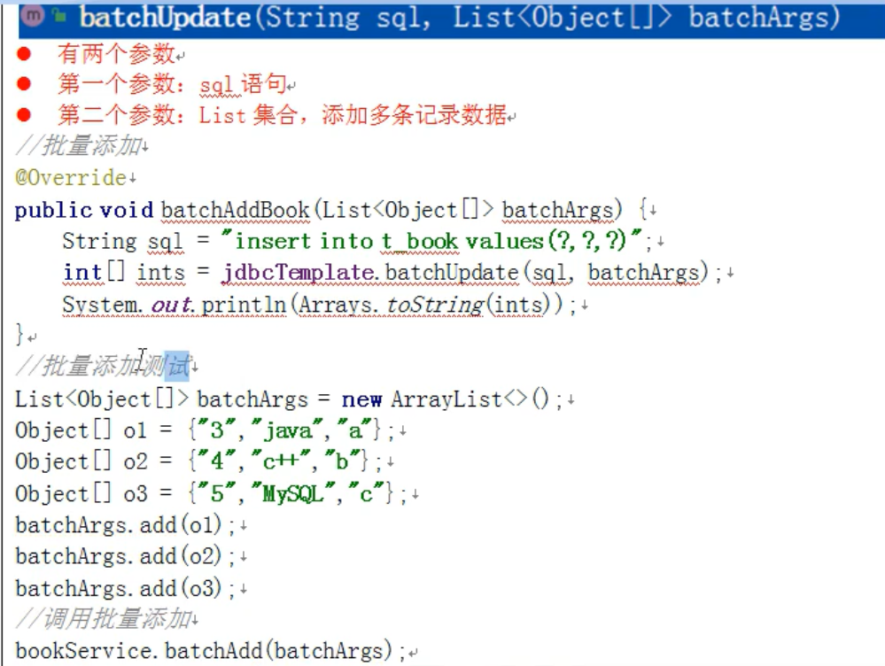

# 事务
1. 什么是事务
   1. 事务时数据库操作的最基本单元，逻辑上一组操作，要么都成功，如果有一个失败所有操作都会失败
   2. 典型场景：银行转账
2. 事务的四大特性（ACID）
   1. 原子性   操作不可分割，要么都成功，要么都失败
   2. 一致性   操作之前和操作之后的总量是不变的
   3. 隔离性   多事务操作时不会产生影响
   4. 持久性   事务提交后表中数据真正发生变化

3. 事务的操作（搭建事务操作环境）
   1. 开启事务操作
   2. 进行业务操作
   3. 没有异常，事务提交  
   4. 出现异常，出现在catch中，事务回滚 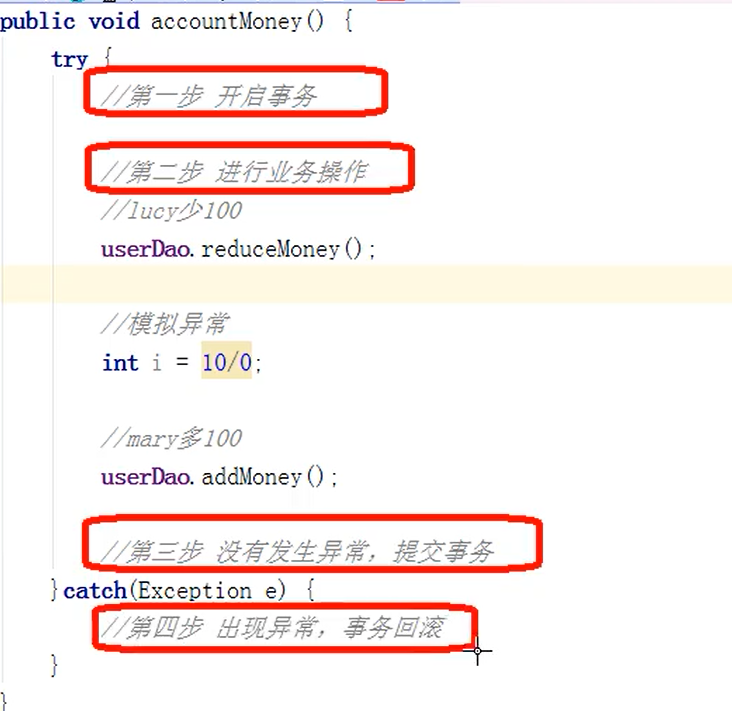
4. spring事务管理操作
   1. 事务一般要添加到javaEE加载serivce层
   2. 在spring进行事务管理操作
      1. 有两种方式：编程式事务管理和声明式事务管理
         1. 通过代码来管理业务叫编程式事务管理
   3. 声明式事务管理
      1. 基于注解方式（使用）
      2. 基于xml配置文件方式
   4. 在Spring进行声明式事务管理，底层使用aop原理
   5. spring事务管理API
      1. 提供一个接口，代表事务管理器，代表事务管理器，这个接口正对不同的框架提供不同的实现类 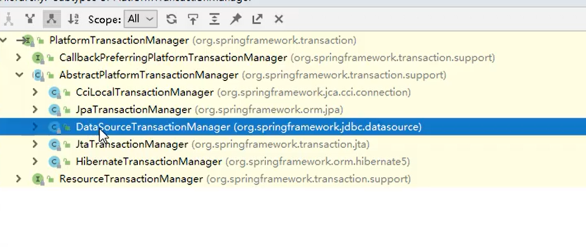
5. 注解声明式事务管理
   1. 在spring配置文件中配置事务管理器
```xml
 <bean id="transactionManager" class="org.springframework.jdbc.datasource.DataSourceTransactionManager">
        <property name="dataSource" ref="dataSource"></property>
    </bean>
```
   2. 在spring配置文件，开启事务注解
      1. 在spring配置文件中引入名称空间 
   3. 在service类上面（或者方法上面加上此注解）   @Transactional 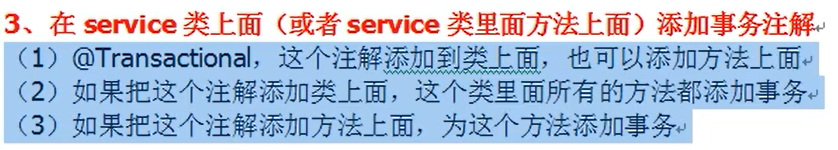
```xml
<beans xmlns="http://www.springframework.org/schema/beans"
       xmlns:xsi="http://www.w3.org/2001/XMLSchema-instance"
       xmlns:context="http://www.springframework.org/schema/context"
       xmlns:tx="http://www.springframework.org/schema/tx"
       xsi:schemaLocation="http://www.springframework.org/schema/beans http://www.springframework.org/schema/beans/spring-beans.xsd
                            http://www.springframework.org/schema/context http://www.springframework.org/schema/context/spring-context.xsd
                            http://www.springframework.org/schema/tx http://www.springframework.org/schema/tx/spring-tx.xsd">
<!--开启事务注解-->
    <tx:annotation-driven transaction-manager="transactionManager"></tx:annotation-driven>
```
6. 事务操作（声明式事务管理参数配置）
   1. 在service添加注解@Transacyional,在这个注解里面可以配置事务相关参数 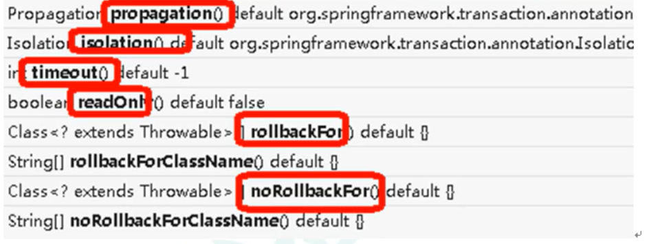
   2. propagation:事务传播行为
      1. 多事务方法直接进行调用，这个过程中事务是如何进行管理的 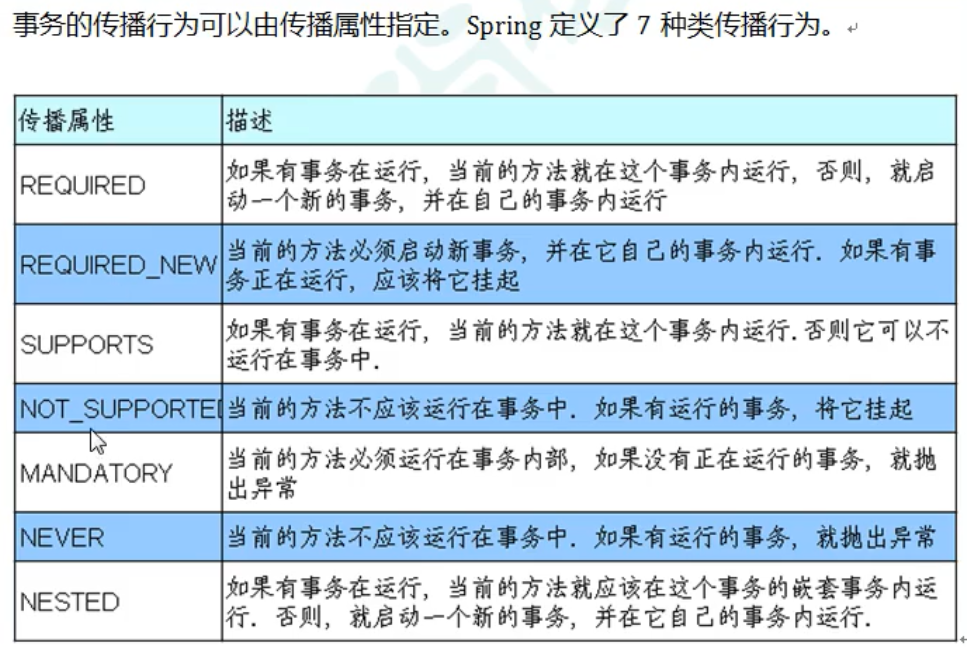
   3. isolation： 事务隔离级别
      1. 事务有特性成位隔离性，多事务操作之间不会产生影响，不考虑隔离性产生很多问题
      2. 有三个读问题：脏读，不可重复读，虚读（幻读）
         1. 脏读：多事务之间，一个未提交的事务读取到另外一个未提交事务的数据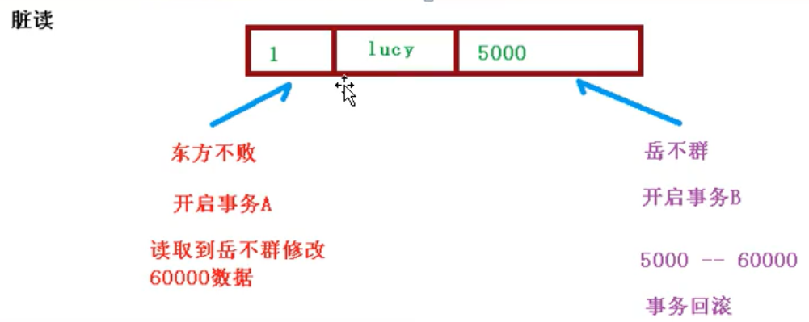
         2. 不可重复读：一个未提交事务读取到另一个提交事务的修改数据
         3. 虚读：一个未提交事务读取到另外提交事务添加的数据
      3. 通过设置事务的隔离性，解决读的问题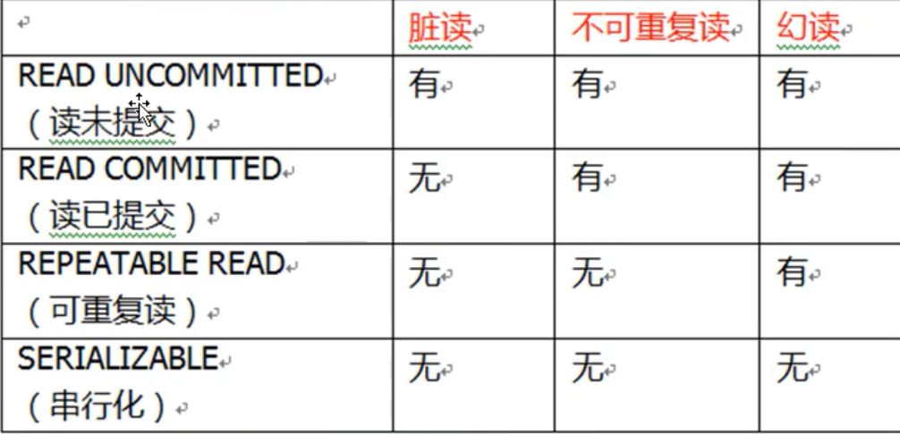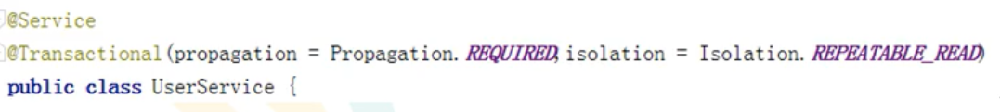
   4. timeout： 超时时间 
      1. 事务需要在一定的时间内提交，如果不提交进行回滚
      2. 默认值是-1，不回滚，设置单位按秒进行计算
   5. readOnly： 是否只读 
      1. 读：查询操作，写：添加修改删除操作
      2. readOnly 默认值false，表示可以查询，可以添加修改删除操作
      3. 设置readOnly 值为true,只能查询了
   6. rollbackFor：回滚
      1. 设置出现那些异常出现那些异常进行事务的回滚
   7. norollbackFor：不回滚
      1. 设置出现那些异常出现那些异常不进行事务的回滚
7. 事务操作（xml声明式事务管理）
   1. 在spring配置文件中进行配置
      1. 配置事务管理器
      2. 配置通知
      3. 配置切入点，切面
```xml
<!-- 第一步： -->
<!--    配置事务管理器-->
    <bean id="transactionManager" class="org.springframework.jdbc.datasource.DataSourceTransactionManager">
        <property name="dataSource" ref="dataSource"></property>
    </bean>
<!-- 第二步： -->
<!--    配置通知-->
    <tx:advice id="txadvice">
<!--        配置事务参数-->
        <tx:attributes>
<!--            指定那种规则的方法上面添加事务-->
            <tx:method name="accountMoney" propagation="REQUIRED" isolation="REPEATABLE_READ" timeout="-1" read-only="false"/>
<!--            <tx:method name="account*"/>-->
        </tx:attributes>
    </tx:advice>
    <!-- 配置切入点 -->
        <aop:config>
<!--        配置切入点-->
        <aop:pointcut id="pt" expression="execution(* com.atguigu.service.TAccountService.*(..))"/>
<!--        配置切面-->
        <aop:advisor advice-ref="txadvice" pointcut-ref="pt"></aop:advisor>
    </aop:config>
``` 
8. 事务操作（完全注解开发） 
```java
@Configuration
@ComponentScan(basePackages = "com.atguigu")
@EnableTransactionManagement  // 开启事务
public class Txconfig {

    
    @Bean
    public DruidDataSource getDruidDataSource(){
        DruidDataSource druidDataSource = new DruidDataSource();
        druidDataSource.setDriverClassName("com.mysql.jdbc.Driver");
        druidDataSource.setUrl("jdbc:mysql://127.0.0.1:3306/jpa");
        druidDataSource.setUsername("root");
        druidDataSource.setPassword("123456");
        return druidDataSource;
    }
//    创建jdbcTemplate对象
    @Bean
    public JdbcTemplate getJdbcTemplate(DataSource druidDataSource){
        JdbcTemplate jdbcTemplate = new JdbcTemplate();
        jdbcTemplate.setDataSource(druidDataSource);
        return jdbcTemplate;
    }
//    创建事务管理器
    @Bean
    public DataSourceTransactionManager getDataSourceTransactionManager(DataSource druidDataSource){
        DataSourceTransactionManager dataSourceTransactionManager = new DataSourceTransactionManager();
        dataSourceTransactionManager.setDataSource(druidDataSource);
        return dataSourceTransactionManager;
    }
}
```

9. spring5框架新的功能  基于java8兼容jdk9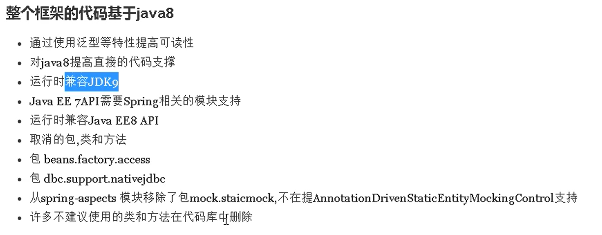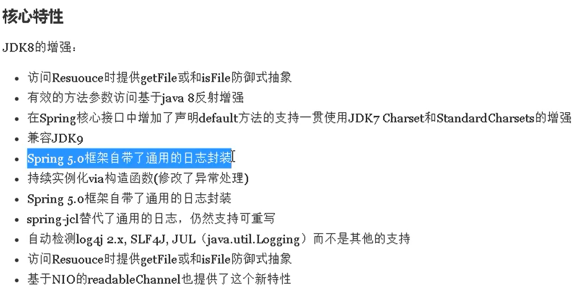
   1.  Spring 5 框架自带了通用的日志封装
       1.  Spring5 已经移除了Log4jConfigListenter,官方建议使用Log4j2
       2.  Spring5框架整合Log4j2
   2. 引入相关的jar包依赖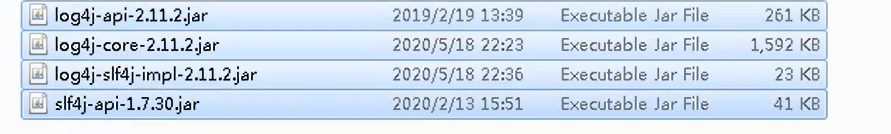
   3. 配置log4j2.xml
```xml
 <dependency>
            <groupId>org.apache.logging.log4j</groupId>
            <artifactId>log4j-api</artifactId>
            <version>2.11.2</version>
        </dependency>
        <dependency>
            <groupId>org.apache.logging.log4j</groupId>
            <artifactId>log4j-core</artifactId>
            <version>2.11.2</version>
        </dependency>
        <dependency>
            <groupId>org.apache.logging.log4j</groupId>
            <artifactId>log4j-slf4j-impl</artifactId>
            <version>2.11.2</version>
        </dependency>
        <dependency>
            <groupId>org.slf4j</groupId>
            <artifactId>slf4j-api</artifactId>
            <version>1.7.30</version>
        </dependency>


        <?xml version="1.0" encoding="utf-8" ?>
<!--日志级别及其优先级排序：OFF>FATAL>ERROR>WARN>INFO>DEBUG>TRACE>ALL-->
<!--configuration 后面的status 用于设置log4j2自身内部的信息输入，可以不设置，当设置成trace时，可以看到log4j2内部各种详细输出-->
<configuration  status="DEBUG">
<!--    先定义所有·的appender-->
    <appenders>
<!--        输出信息到控制台-->
        <console name="Console" target="SYSTEM_OUT">
<!--            控制日志输出的格式-->
            <PatternLayout pattern="%d{yyyy-MM-dd HH:mm:ss.SSS} [%t] %-5level %logger{36} -%msg%n"/>
        </console>
    </appenders>
<!--    然后定义logger 只有定义了logger并引入apperder，appender 才会生效-->
<!--    root,用于指定项目的根日志，如果没有单独指定Logger，则会使用root作为默认的日志输出-->
    <loggers>
        <root level="info">
            <appender-ref ref="Console"></appender-ref>
        </root>
    </loggers>
</configuration>
```
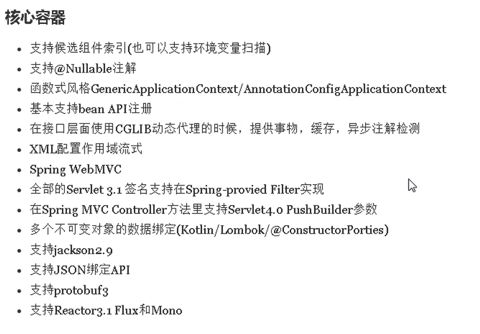
10. Spring5 核心容器支持@Nullable 注解
    1.  @Nullable 注解 使用在方法上，属性上 ，参数上 ，表示方法返回可以为空，属性值可以空，参数值可以为空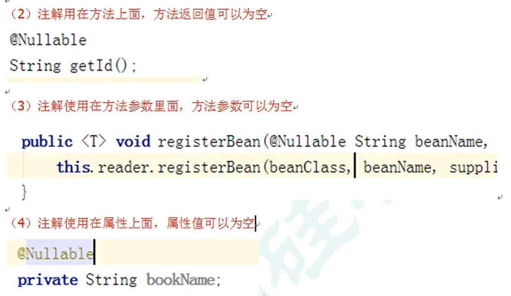
11. Spring5 核心容器支持函数式风格GenercApplicationContext 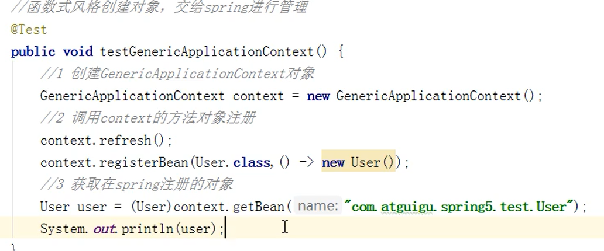
12. spring5 支持Junit5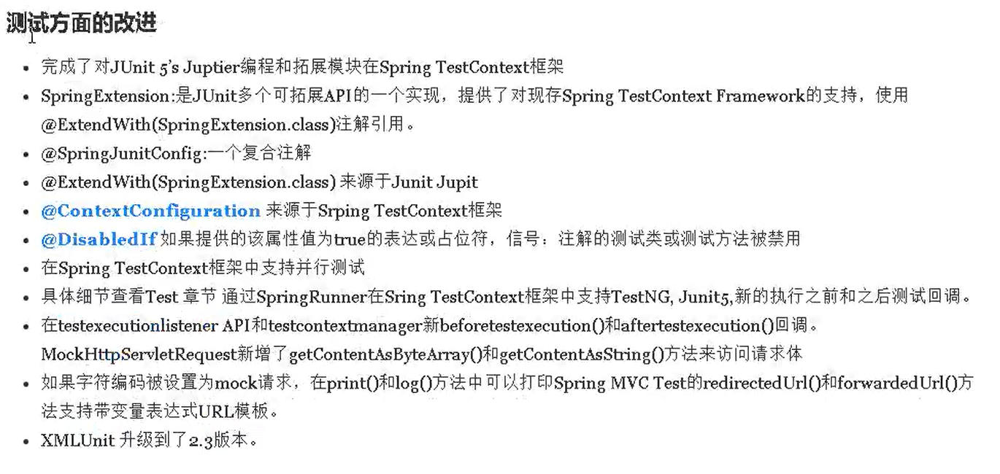
    1.  整合junit4
        1.  引入针对测试相关的依赖
        2.  创建测试类，使用注解方式完成测试 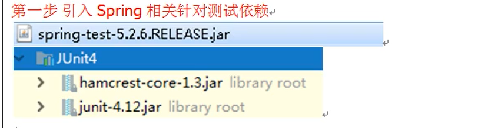
    2. spring5整合Junit5 可以使用一个复合的注解去整合上面两个注解@SpringJUnitConfig


```xml
<!-- 1. -->
 <dependency>
            <groupId>org.springframework</groupId>
            <artifactId>spring-test</artifactId>
            <version>5.2.6.RELEASE</version>
        </dependency>

```
```java
// 2.
@RunWith(SpringJUnit4ClassRunner.class)
@ContextConfiguration("classpath:bean1.xml")
public class JTest4 {
    @Autowired
    private TAccountService tAccountService;

    @Test
    public void adds(){
        tAccountService.asd();
    }
}
```

```java
package com.atguigu.test;

import com.atguigu.service.TAccountService;

import org.junit.jupiter.api.Test;
import org.junit.jupiter.api.extension.ExtendWith;
import org.springframework.beans.factory.annotation.Autowired;
import org.springframework.test.context.ContextConfiguration;
import org.springframework.test.context.junit.jupiter.SpringExtension;

/**
 * @version 1.0
 * 注意：本内容仅限于西安城市发展资源信息有限公司内部传阅，禁止外泄以及用于其他的商业目
 * @ClassName JTest5
 * @Description TODO
 * @Aurhor xu
 * @Ddte 2021/3/7 18:52
 **/
//@ExtendWith(SpringExtension.class)
//@ContextConfiguration("classpath:bean1.xml")
    @SpringJUnitConfig(locations = "classpath:bean1.xml")
public class JTest5 {

    @Autowired
    private TAccountService tAccountService;

    @Test
    public void adds(){
        tAccountService.asd();
    }
}
```


    