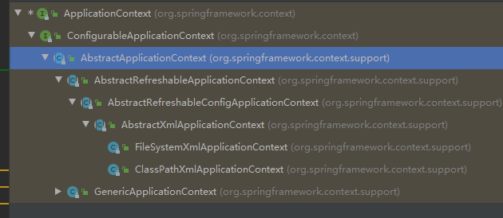

# Spring 框架概述
## 1、spring是一个开源的轻量级容器框架
## 2、spring可以解决企业应用开发的复杂性
## 3、spring 的两个核心： ioc 和 aop
1. ioc控制反转 ，把创建对象的权利交给spring容器管理
2. aop：面向切面变成，不修改源代码的情况下对功能进行增强
## 4、spring特点
1. 方便解耦，简化开发
2. aop编程
3. 方便程序的测试
4. 方便和其他框架进行整合
5. 方便进行对事物操作
6. 降低api 开发难度

## spring 下载地址
https://repo.spring.io/release/org/springframework/spring/

spring5模块


# ioc 容器

1. 什么是ioc 
  1.控制反转，把对象的创建和对象之间调用的过程，交给spring管理
  2.使用ioc目的，为了耦合度降低
2. ioc底层园路
   1.xml解析、工厂模式、反射
3. 底层原理：


> ioc思想
> 1. ioc思想基于ioc容器完成，ioc容器底层就是对象工厂
> 2. Spring 提供 ioc容器实现的两种方式（两个接口）
>  - 1. BeanFactory: ioc容器基本实现，是spring内部使用接口，不提供给开发人员
>  -  >   加载配置文件时，不会创建对象，在获取对象使用时，才会创建对象
>  - 2. ApplicationContext：BeanFactory接口的子接口，提供更强大的功能，一般有开发人员进行使用。
>  -  > 记载配置文件时候就会把在配置文件对象进行创建

ApplicationContext:
 
new FileSystemXmlApplicationContext("") 里面写的是在盘中的绝对路劲 

ClassPathXmlApplicationContext（“”） src下类路径

##  ioc操作bean管理
1. 什么是bean管理
- Bean管理指的是两个操作
- spring创建对象
- Spring注入属性
2. Bean管理操作有两种方式
- 基于xml配置文件方式实现
- 基于注解方式实现

## ioc 操作Bean管理（基于xml方式）
1. 基于xml方式创建对象
```xml
    <bean id="user" class="com.atguigu.User"/>
    <!-- 1.在spring配置文件中，使用bean标签，标签里面添加对应属性，就可以实现对象创建
    2.在bean标签里面有很多属性
    * id属性
    * class属性 
    3. 创建对象时，会默认去执行无参构造方法-->
```
2. 基于xml方式注入属性
    1.DI: 依赖注入，就是注入属性
-   使用set方法注入
     配置文件：
     ```xml
         <!--    配置User对象的创建-->
    <bean id="user" class="com.atguigu.User">
<!--        使用property 完成属性注入
   name : 要注入的属性名称
   value :要注入的属性的值
-->
        <!-- 依赖注入-->
        <property name="name" value="zhangsan"></property>
    </bean>
    ```
-   使用有参构造注入

```xml
    <bean id="user" class="com.atguigu.User">
        <constructor-arg name="name" value="zhansan"></constructor-arg>
    </bean>
```

内部bean的方式注入属性：

<!-- 必须生成使用方的get方法 -->


抽取公共注入属性


# ioc 操作管理Bean(factoryBean)
1. spring中有两种类型的bean ，一种普通bean，另外一种就是工厂FactoryBean
2. 普通bean: 定义的什么类型，返回是什么什么类型
3. 工厂bean：在配置文件定义的bean类型可以和返回类型不一样
   
# ioc 操作管理bean （作用域）
1. 在spring里面，设置创建bean实例是单实例还是多实例
2. 在默认情况下，默认设置bean为单实例
 
1. 如何设置单实例还是多是列
> 在spring 配置文件bean标签里面有属性（scope）用于设置单实例还是多实例
> scope属性值：
>  默认值 ： singleton  表示单实例（默认为此值）
>            prototype 表示多实例对象

区别：
- singleton 和prototype 区别
- 单实例   多实例
- 设置scope值是sigleton 时候，加载spring配置文件时就会创建单实例对象
- 设置scope 为 prototype ,不是在加载配置spring配置文件的时候去创建对象，在调用getBean方法时创建多实例对象


# ioc操作bean管理（bean生命周期）
1. 生命周期
   1. 从创建到销毁的过程
2. bean生命周期
   1. 通过构造器去创建bean实例（无参构造）
   2. 为bean的属性设置值和对其他bean引用（调用set方法）
   3. 调用bean的初始化的方法（需要自己进行配置初始化方法）
   4. bean可以使用了
   5. 当容器在关闭的时候。调用bean的销毁的方法（需要惊醒配置销毁的方法）
3. bean的生命周期严格来说有七步
   1. 通过构造器去创建bean实例（无参构造）
   2. 为bean的属性设置值和对其他bean引用（调用set方法）
   3. 把bean的实例传递给bean后置处理器的方法   postProcessBeforeInitization (后置处理器创建后必须注入bean)
   4. 调用bean的初始化的方法（需要自己进行配置初始化方法）
   5. 把bean实例传递给bean后置处理器的方法postProcessAfterInitization
   6. bean可以使用了
   7. 当容器在关闭的时候。调用bean的销毁的方法（需要惊醒配置销毁的方法）、Snipaste_2021-03-05_11-12-31.png
# ioc操作bean管理（xml自动装配）
1. 自动装配
   1. 什么是自动装配，根据指定装配规则（属性名称或者属性类型），spring自动会将匹配的属性值进行注入（autowire）
#  引入外部配置文件


# 基于注解方式实现对象创建及其注入属性
1. 什么是注解
   1. 注解是代码里面特殊的标记，格式 @注解名称 （属性名称 = 属性值，属性名称 = 属性值...）
   2. 使用注解，注解可以作用在类、方法、属性上
   3. 注解的目的，简化xml配置，使用更简洁的方式执行
2. Spring针对Bean管理中的创建对象提供注解（）
   1. @Component 普通组件
   2. @Service  业务逻辑层
   3. @Controller  web层
   4. @Repository  持久层
   5.  上面的四个注解功能是一样，都可以用来创建Bean的对象
3. 
4. 
5. 
6. 基于注解方式实现属性注入
   1. @AutoWired   根据属性类型惊醒自动装配
   2. @Qualifier   更具属性名称注入
   3. Resource     可以根据类型注入，也可以根据名称注入
   4. @Value       注入普通类型
   5. 
   6. 
7. 纯注解开发
   1.  创建配置类，替代xml配置文件， 
 ```java
    @Configuration  // 加此注解，开启配置类，替代Xml配置文件
    @ComponentScan(basePackages = "com")
    public class SpringConfig {

    }
```
#  aop
1. aop基本概念
   1. 面向切面编程，可以对各个业务的逻辑进行隔离，降低各个业务之间的耦合度，提高程序的可重用性，同时提高了开发的效率
2. aop底层原理 动态代理
   1. 有接口的情况
      1. JDK动态代理   
   2. 没有接口的情况
      1. 使用CGLIB动态代理 
   3. JDk动态代理     
3. aop术语
   1. 连接点
   2. 切入点
   3. 通知（增强）
   4. 切面。
    
4. Aop操作（准备） 
   1. Spring框架一般基于AspectJ实现Aop操作 
        1. AspectJ 不是Spring组成成分，独立Aop，一般AspectJ和Spring  框架一起使用，进行Aop操作
   2. 基于Aspectj 实现aop操作
        1. 基于xml配置文件实现
        2. 基于注解方式实现（实际使用）
   3. 引入aop依赖
        
   4. 切入点表达式
        1. 切入点表达式作用，知道对哪个类里面的哪个方法惊醒增强
        2. 语法结构  execution([权限修饰符][返回类型][类全路径][方法名称]([参数列表]))  ps:对com.atgui.dao.book类里面的add(int i, int b )方法增强   execution(* com.atgui.dao.book.add(..))
对com.atgui.dao.book类里面的suoyou方法增强 execution(* com.atgui.dao.book.*(..))   对com.atgui.dao包里面的suoyou方法增强 execution(* com.atgui.dao.*.*(..))
5. Aop操作（AspectJ注解）
    1. 创建类，在类里面定义方法    
    2. 创建增强的类(编写增强的逻辑)
        1. 在增强类里面，创建方法，让不同的方法代表不同的通知类型
    3. 进行通知的配置
        1. 在spring配置文件中，开启注解扫描
        2. 使用注解创建User和UserProcy
        3. 在增强类上添加注解@Aspect
        4. 在spring配置文件中开启生成代理对象
            1. 在增强类的里面，在作为通知方法上面添加通知类型注解，使用切入点表达式配置
   
```java xml
第一步：
public class User {
    public void add(){
        System.out.println("add");
    }
}
第二步：
@Component
@Aspect
public class UserProcy {

    @Before("execution(* com.atgui.Aopanno.User.add(..))")
    public void before(){
        System.out.println("before");
    }
}
<!--第三步 -->
<?xml version="1.0" encoding="UTF-8"?>
<beans xmlns="http://www.springframework.org/schema/beans"
       xmlns:xsi="http://www.w3.org/2001/XMLSchema-instance"
       xmlns:context="http://www.springframework.org/schema/context"
       xmlns:aop="http://www.springframework.org/schema/aop"
       xsi:schemaLocation="http://www.springframework.org/schema/beans http://www.springframework.org/schema/beans/spring-beans.xsd
                           http://www.springframework.org/schema/context http://www.springframework.org/schema/context/spring-context.xsd
                           http://www.springframework.org/schema/aop http://www.springframework.org/schema/aop/spring-aop.xsd">
<!--    开启注解扫描-->
        <context:component-scan base-package="com.atgui.Aopanno"></context:component-scan>
<!--    开启Aspect生成代理对象-->
    <aop:aspectj-autoproxy></aop:aspectj-autoproxy>
</beans>
``` 
@Component
@Aspect
public class UserProcy {

    // 前置通知
    @Before("execution(* com.atgui.Aopanno.User.add(..))")
    public void before(){
        System.out.println("before");
    }
    // 最终通知
    @After("execution(* com.atgui.Aopanno.User.add(..))")
    public void after(){
        System.out.println("after");
    }
    // 后置通知（返回通知）
    @AfterReturning("execution(* com.atgui.Aopanno.User.add(..))")
    public void AfterReturning(){
        System.out.println("AfterReturning");
    }
    
    @AfterThrowing("execution(* com.atgui.Aopanno.User.add(..))")
    public void AfterThrowing(){
        System.out.println("AfterThrowing");
    }
    @Around("execution(* com.atgui.Aopanno.User.add(..))")
    public void Around(ProceedingJoinPoint proceedingJoinPoint) throws Throwable {
        System.out.println("坏绕之前");
        proceedingJoinPoint.proceed();  // 调用这个方法
        System.out.println("坏绕之后");
    }

5. 公共切入点进行抽取
```java
  @Pointcut(value = "execution(* com.atgui.Aopanno.User.add(..))")
    public void pointdemo(){
        
    }

    // 前置通知
    @Before("pointdemo()")
    public void before(){
        System.out.println("before");
    }
```
6. 有多个增强类，对同一个方法进行增强，可以设置增强类的优先级
    1. 在增强类上面添加注解@Order(数字类型取值)，数字类型值越小优先级越高   


二、 aop操作（AspectJ配置文件）
1. 创建 两个类 ，增强类和被增强类，创建方法
2. 在spring配置文件中船舰两个类的对象
3. 在spring配置文件中配置切入点
```java
public class Book {
    public void buy(){
        System.out.println("book....");
    }
}
public class BookProxy {
    public void befor(){
        System.out.println("before...");
    }
}
```
```xml 
<?xml version="1.0" encoding="UTF-8"?>
<beans xmlns="http://www.springframework.org/schema/beans"
       xmlns:xsi="http://www.w3.org/2001/XMLSchema-instance"
       xmlns:context="http://www.springframework.org/schema/context"
       xmlns:aop="http://www.springframework.org/schema/aop"
       xsi:schemaLocation="http://www.springframework.org/schema/beans http://www.springframework.org/schema/beans/spring-beans.xsd
                           http://www.springframework.org/schema/context http://www.springframework.org/schema/context/spring-context.xsd
                           http://www.springframework.org/schema/aop http://www.springframework.org/schema/aop/spring-aop.xsd">

    <bean id="book" class="com.atgui.aopxml.Book"></bean>
    <bean id="bookProxy" class="com.atgui.aopxml.BookProxy"></bean>

<!--    aop增强-->
    <aop:config>
<!--        切入点-->
        <aop:pointcut id="p" expression="execution(* com.atgui.aopxml.Book.buy(..))"/>
<!--        配置切面-->
        <aop:aspect ref="bookProxy">
<!--            设置具体增强在哪个方法上-->
            <aop:before method="befor" pointcut-ref="p"></aop:before>
        </aop:aspect>
    </aop:config>
</beans>
```

7. 完全使用注解开发，不需要创建xml配置文件
```java

@Configuration  // 加此注解，开启配置类，替代Xml配置文件
@ComponentScan(basePackages = {"com"})
//<!--    开启Aspect生成代理对象-->
//<aop:aspectj-autoproxy></aop:aspectj-autoproxy>
@EnableAspectJAutoProxy(proxyTargetClass = true)
public class SpringConfig {

}
```


