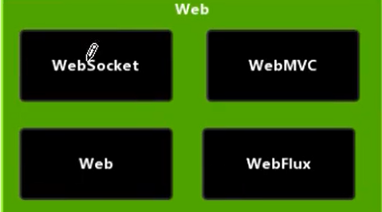
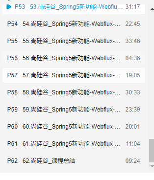

1. 概念简介
   1. 是Spring5 添加新得模块，用于web开发，功能SpringMvc类似得，WebFlux使用当前一种比较流行的响应式编程出现的框架
   2. 使用传统的Web 框架，比如SpringMvc ,这些基于Servlet容器，webFlux 是一种异步非阻塞的框架，异步非阻塞的框架在Servlet3.1之后才支持，核心是基于Reactor的相关的API实现的
2. 响应式编程
3. WebFlux 执行流程和核心Api
4. SpringWebFlux(基于注解编程模型)
5. SpringWebFlux(基于函数式编程模型)

https://www.bilibili.com/video/BV1Vf4y127N5?p=53&spm_id_from=pageDriver
