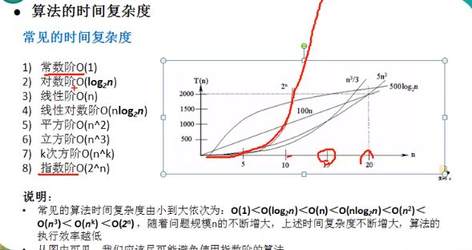
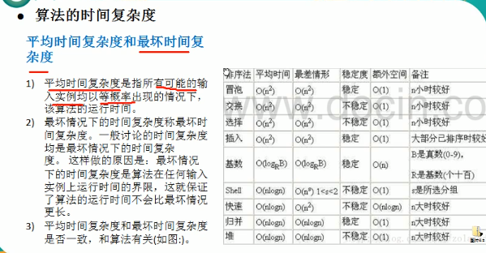
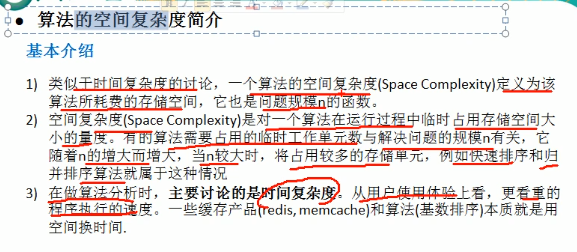

# 排序算法
排序是将一组数据，以指定的顺序进行排列的过程
分类
1. 内部排序  将索要处理的数据都加载到内部存储器中进行排序
>- 插入排序
>>- 直接插入排序
>>- 希尔排序
>- 选择排序
>>- 简单选择排序
>>- 堆排序
>- 交换排序
>>- 冒泡排序
>>- 快速排序kongji
>- 归并排序 
>- 基数排序
2. 外部排序  数据量过大，无法加载到内存中，需要借助外部存储进行排序

- 常见的算法复杂度：
 
 
 

# 冒泡算法
对大小为n的数组中的所有数字进行排序，最后呈现由小到大
冒泡思路：
 第一次 在1-n-1的数组中，挑选出最大的数排在最后一位
 第二次 在1-n-1-1的位列中，挑选最大的数排在倒数第二位
 依次排列  即冒泡算法

 # 快速排序
 对大小为n的数组中的所有数字进行排序，最后呈现由小到大
1. 快速排序思路:
> 选择最小的放在第一位，倒数第二小放在第二位，一次类推 即可